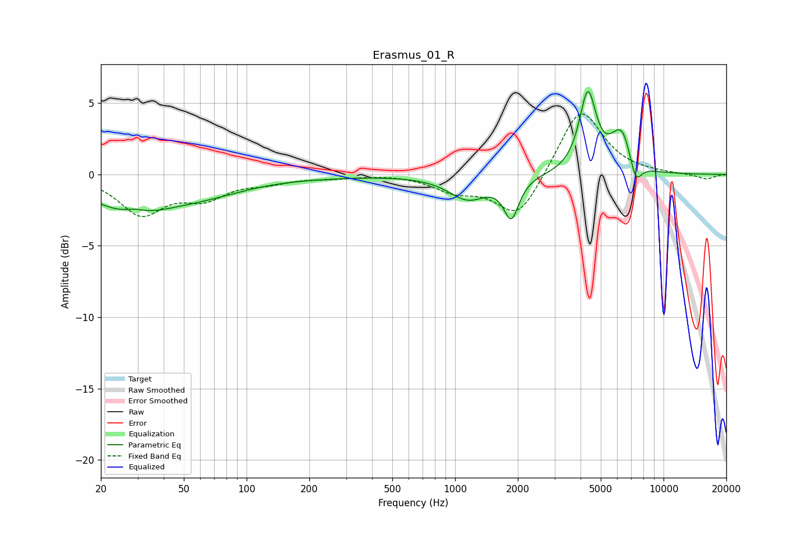

# Erasmus_01_R
See [usage instructions](https://github.com/jaakkopasanen/AutoEq#usage) for more options and info.

### Parametric EQs
Apply preamp of -5.9 dB when using parametric equalizer.

|   # | Type    |   Fc (Hz) |    Q |   Gain (dB) |
|-----|---------|-----------|------|-------------|
|   1 | Peaking |        27 | 0.75 |        -2.3 |
|   2 | Peaking |        29 | 2.87 |         0.3 |
|   3 | Peaking |        61 | 0.63 |        -1.1 |
|   4 | Peaking |       244 | 0.65 |        -0.1 |
|   5 | Peaking |      1154 | 1.52 |        -1.7 |
|   6 | Peaking |      1861 | 3.92 |        -2.7 |
|   7 | Peaking |      4332 | 3.49 |         5.5 |
|   8 | Peaking |      6099 | 2.75 |         2.1 |
|   9 | Peaking |      6471 | 4.71 |         0.8 |
|  10 | Peaking |      7369 | 4.93 |        -1.5 |

### Fixed Band EQs
When using fixed band (also called graphic) equalizer, apply preamp of **-4.3 dB** (if available) and set gains manually with these parameters.

|   # | Type    |   Fc (Hz) |    Q |   Gain (dB) |
|-----|---------|-----------|------|-------------|
|   1 | Peaking |        31 | 1.41 |        -2.7 |
|   2 | Peaking |        62 | 1.41 |        -1.4 |
|   3 | Peaking |       125 | 1.41 |        -0.5 |
|   4 | Peaking |       250 | 1.41 |        -0.2 |
|   5 | Peaking |       500 | 1.41 |         0.1 |
|   6 | Peaking |      1000 | 1.41 |        -1   |
|   7 | Peaking |      2000 | 1.41 |        -3.1 |
|   8 | Peaking |      4000 | 1.41 |         4.8 |
|   9 | Peaking |      8000 | 1.41 |         0   |
|  10 | Peaking |     16000 | 1.41 |        -0.3 |

### Graphs

