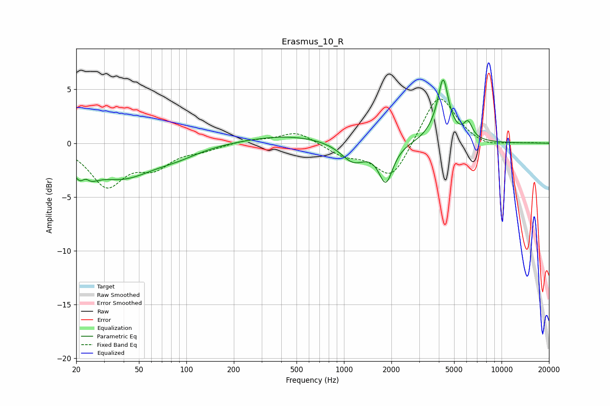

# Erasmus_10_R
See [usage instructions](https://github.com/jaakkopasanen/AutoEq#usage) for more options and info.

### Parametric EQs
Apply preamp of -6.0 dB when using parametric equalizer.

|   # | Type    |   Fc (Hz) |    Q |   Gain (dB) |
|-----|---------|-----------|------|-------------|
|   1 | Peaking |        22 | 2.72 |        -3.4 |
|   2 | Peaking |        23 | 4.55 |         1.9 |
|   3 | Peaking |        39 | 0.69 |        -3   |
|   4 | Peaking |        88 | 1.03 |        -0.6 |
|   5 | Peaking |       436 | 0.54 |         0.8 |
|   6 | Peaking |      1147 | 1.77 |        -1.8 |
|   7 | Peaking |      1843 | 3.19 |        -3.5 |
|   8 | Peaking |      4174 | 2.11 |         2.1 |
|   9 | Peaking |      4265 | 4.9  |         3.9 |
|  10 | Peaking |      6127 | 5.05 |         1.4 |

### Fixed Band EQs
When using fixed band (also called graphic) equalizer, apply preamp of **-4.2 dB** (if available) and set gains manually with these parameters.

|   # | Type    |   Fc (Hz) |    Q |   Gain (dB) |
|-----|---------|-----------|------|-------------|
|   1 | Peaking |        31 | 1.41 |        -3.8 |
|   2 | Peaking |        62 | 1.41 |        -1.9 |
|   3 | Peaking |       125 | 1.41 |        -0.5 |
|   4 | Peaking |       250 | 1.41 |         0.3 |
|   5 | Peaking |       500 | 1.41 |         1.1 |
|   6 | Peaking |      1000 | 1.41 |        -1   |
|   7 | Peaking |      2000 | 1.41 |        -3.4 |
|   8 | Peaking |      4000 | 1.41 |         4.8 |
|   9 | Peaking |      8000 | 1.41 |        -0.5 |
|  10 | Peaking |     16000 | 1.41 |         0   |

### Graphs

