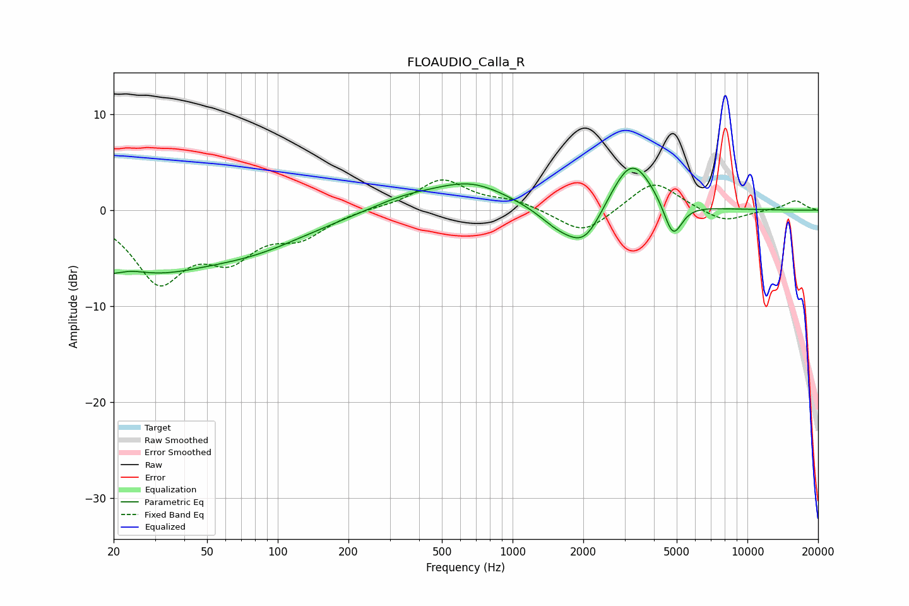

# FLOAUDIO_Calla_R
See [usage instructions](https://github.com/jaakkopasanen/AutoEq#usage) for more options and info.

### Parametric EQs
Apply preamp of -4.5 dB when using parametric equalizer.

|   # | Type    |   Fc (Hz) |    Q |   Gain (dB) |
|-----|---------|-----------|------|-------------|
|   1 | Peaking |        20 | 4.97 |        -4.8 |
|   2 | Peaking |        20 | 5.87 |         3.3 |
|   3 | Peaking |        28 | 0.6  |        -5.1 |
|   4 | Peaking |        77 | 0.55 |        -3.2 |
|   5 | Peaking |       344 | 0.95 |         1.1 |
|   6 | Peaking |       665 | 0.86 |         2.7 |
|   7 | Peaking |      1559 | 1.66 |        -1.6 |
|   8 | Peaking |      2031 | 1.8  |        -3.9 |
|   9 | Peaking |      3210 | 1.54 |         5.7 |
|  10 | Peaking |      4817 | 3.54 |        -3.9 |

### Fixed Band EQs
When using fixed band (also called graphic) equalizer, apply preamp of **-3.3 dB** (if available) and set gains manually with these parameters.

|   # | Type    |   Fc (Hz) |    Q |   Gain (dB) |
|-----|---------|-----------|------|-------------|
|   1 | Peaking |        31 | 1.41 |        -7   |
|   2 | Peaking |        62 | 1.41 |        -4.2 |
|   3 | Peaking |       125 | 1.41 |        -2.4 |
|   4 | Peaking |       250 | 1.41 |         0.2 |
|   5 | Peaking |       500 | 1.41 |         3.2 |
|   6 | Peaking |      1000 | 1.41 |         0.9 |
|   7 | Peaking |      2000 | 1.41 |        -2.6 |
|   8 | Peaking |      4000 | 1.41 |         3.2 |
|   9 | Peaking |      8000 | 1.41 |        -1.3 |
|  10 | Peaking |     16000 | 1.41 |         1   |

### Graphs

