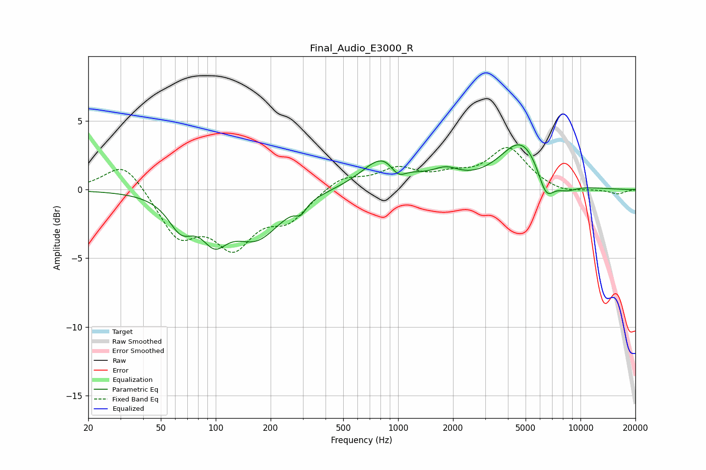

# Final_Audio_E3000_R
See [usage instructions](https://github.com/jaakkopasanen/AutoEq#usage) for more options and info.

### Parametric EQs
Apply preamp of -3.4 dB when using parametric equalizer.

|   # | Type    |   Fc (Hz) |    Q |   Gain (dB) |
|-----|---------|-----------|------|-------------|
|   1 | Peaking |        64 | 2.06 |        -2.2 |
|   2 | Peaking |        98 | 2.02 |        -2.5 |
|   3 | Peaking |       167 | 1.06 |        -3.3 |
|   4 | Peaking |       293 | 5.05 |        -0.7 |
|   5 | Peaking |       851 | 1.24 |         2.6 |
|   6 | Peaking |       996 | 3.04 |        -1.2 |
|   7 | Peaking |      1826 | 1.9  |         0.9 |
|   8 | Peaking |      4774 | 1.16 |         3.6 |
|   9 | Peaking |      6470 | 2.93 |        -2.1 |
|  10 | Peaking |      8302 | 2.04 |        -0.6 |

### Fixed Band EQs
When using fixed band (also called graphic) equalizer, apply preamp of **-3.2 dB** (if available) and set gains manually with these parameters.

|   # | Type    |   Fc (Hz) |    Q |   Gain (dB) |
|-----|---------|-----------|------|-------------|
|   1 | Peaking |        31 | 1.41 |         2.2 |
|   2 | Peaking |        62 | 1.41 |        -3.3 |
|   3 | Peaking |       125 | 1.41 |        -3.7 |
|   4 | Peaking |       250 | 1.41 |        -2   |
|   5 | Peaking |       500 | 1.41 |         1   |
|   6 | Peaking |      1000 | 1.41 |         1.4 |
|   7 | Peaking |      2000 | 1.41 |         0.8 |
|   8 | Peaking |      4000 | 1.41 |         2.9 |
|   9 | Peaking |      8000 | 1.41 |        -0.3 |
|  10 | Peaking |     16000 | 1.41 |        -0.3 |

### Graphs

