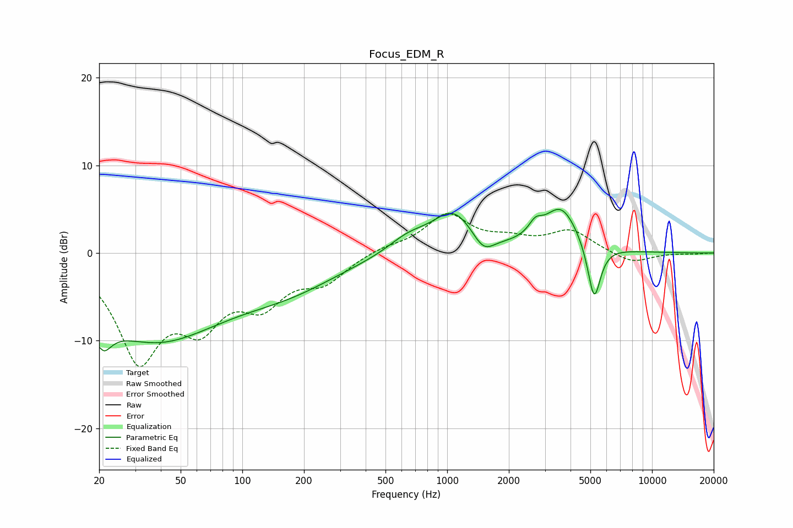

# Focus_EDM_R
See [usage instructions](https://github.com/jaakkopasanen/AutoEq#usage) for more options and info.

### Parametric EQs
Apply preamp of -5.1 dB when using parametric equalizer.

|   # | Type    |   Fc (Hz) |    Q |   Gain (dB) |
|-----|---------|-----------|------|-------------|
|   1 | Peaking |        20 | 4.24 |       -10.1 |
|   2 | Peaking |        20 | 6    |         6.8 |
|   3 | Peaking |        38 | 0.4  |        -9.6 |
|   4 | Peaking |       174 | 0.57 |        -2.7 |
|   5 | Peaking |       645 | 1.4  |         1.7 |
|   6 | Peaking |      1073 | 1.37 |         4.5 |
|   7 | Peaking |      1504 | 2.72 |        -2   |
|   8 | Peaking |      2694 | 4.32 |         1.4 |
|   9 | Peaking |      3602 | 1.64 |         5.1 |
|  10 | Peaking |      5216 | 4.38 |        -6.6 |

### Fixed Band EQs
When using fixed band (also called graphic) equalizer, apply preamp of **-4.6 dB** (if available) and set gains manually with these parameters.

|   # | Type    |   Fc (Hz) |    Q |   Gain (dB) |
|-----|---------|-----------|------|-------------|
|   1 | Peaking |        31 | 1.41 |       -11.5 |
|   2 | Peaking |        62 | 1.41 |        -6.5 |
|   3 | Peaking |       125 | 1.41 |        -4.8 |
|   4 | Peaking |       250 | 1.41 |        -2.9 |
|   5 | Peaking |       500 | 1.41 |         0.6 |
|   6 | Peaking |      1000 | 1.41 |         4.2 |
|   7 | Peaking |      2000 | 1.41 |         1.2 |
|   8 | Peaking |      4000 | 1.41 |         2.5 |
|   9 | Peaking |      8000 | 1.41 |        -1.2 |
|  10 | Peaking |     16000 | 1.41 |        -0.1 |

### Graphs

