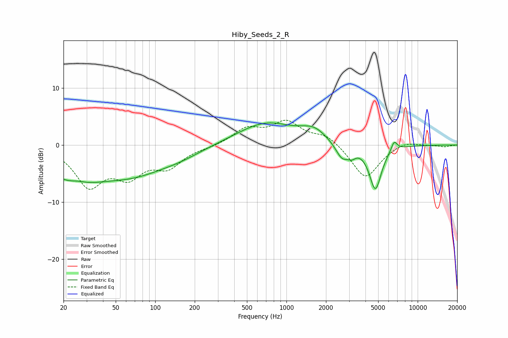

# Hiby_Seeds_2_R
See [usage instructions](https://github.com/jaakkopasanen/AutoEq#usage) for more options and info.

### Parametric EQs
Apply preamp of -4.0 dB when using parametric equalizer.

|   # | Type    |   Fc (Hz) |    Q |   Gain (dB) |
|-----|---------|-----------|------|-------------|
|   1 | Peaking |        24 | 0.86 |        -6   |
|   2 | Peaking |        25 | 1.7  |         1.9 |
|   3 | Peaking |        66 | 0.49 |        -4.7 |
|   4 | Peaking |       158 | 0.92 |        -0.8 |
|   5 | Peaking |       698 | 0.64 |         3.9 |
|   6 | Peaking |      1619 | 1.47 |         2   |
|   7 | Peaking |      2655 | 2.77 |        -2.8 |
|   8 | Peaking |      3153 | 4.82 |        -1   |
|   9 | Peaking |      4760 | 2.99 |        -7.8 |
|  10 | Peaking |      6618 | 5.92 |         1.8 |

### Fixed Band EQs
When using fixed band (also called graphic) equalizer, apply preamp of **-4.4 dB** (if available) and set gains manually with these parameters.

|   # | Type    |   Fc (Hz) |    Q |   Gain (dB) |
|-----|---------|-----------|------|-------------|
|   1 | Peaking |        31 | 1.41 |        -6.8 |
|   2 | Peaking |        62 | 1.41 |        -4.6 |
|   3 | Peaking |       125 | 1.41 |        -3.4 |
|   4 | Peaking |       250 | 1.41 |        -0.3 |
|   5 | Peaking |       500 | 1.41 |         2.7 |
|   6 | Peaking |      1000 | 1.41 |         3.8 |
|   7 | Peaking |      2000 | 1.41 |         1.8 |
|   8 | Peaking |      4000 | 1.41 |        -6   |
|   9 | Peaking |      8000 | 1.41 |         0.8 |
|  10 | Peaking |     16000 | 1.41 |        -0.3 |

### Graphs

