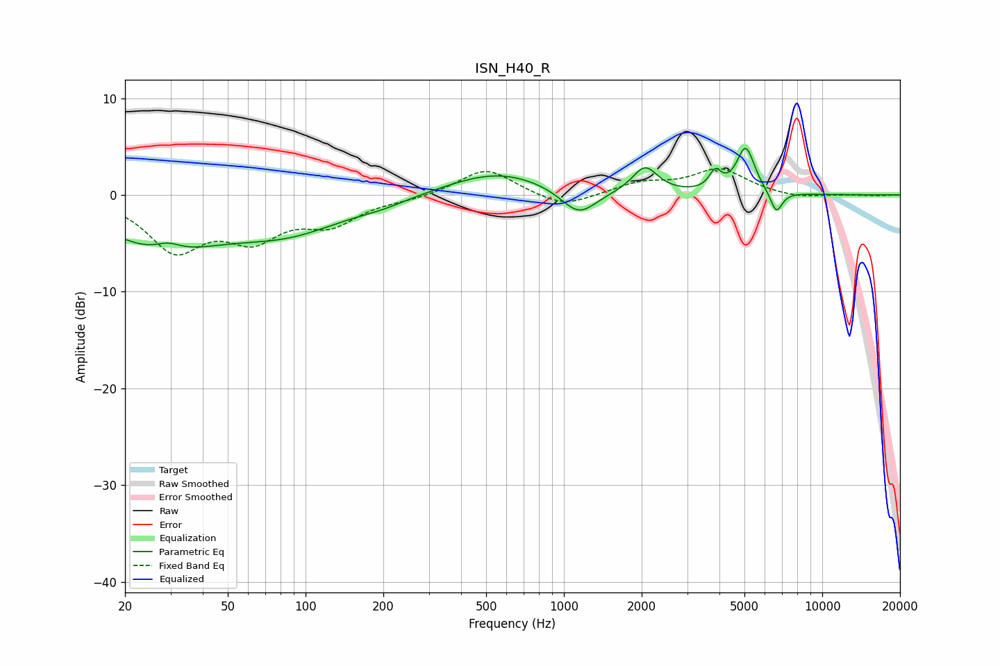

# ISN_H40_R
See [usage instructions](https://github.com/jaakkopasanen/AutoEq#usage) for more options and info.

### Parametric EQs
Apply preamp of -4.9 dB when using parametric equalizer.

|   # | Type    |   Fc (Hz) |    Q |   Gain (dB) |
|-----|---------|-----------|------|-------------|
|   1 | Peaking |        27 | 0.63 |        -5   |
|   2 | Peaking |        29 | 2.87 |         0.9 |
|   3 | Peaking |        86 | 0.63 |        -3.3 |
|   4 | Peaking |       198 | 1.46 |        -0.5 |
|   5 | Peaking |       552 | 0.73 |         2.4 |
|   6 | Peaking |      1142 | 2.05 |        -2.7 |
|   7 | Peaking |      2060 | 2.89 |         2.8 |
|   8 | Peaking |      3854 | 6    |         1.8 |
|   9 | Peaking |      5056 | 4.02 |         4.8 |
|  10 | Peaking |      6639 | 5.91 |        -2.3 |

### Fixed Band EQs
When using fixed band (also called graphic) equalizer, apply preamp of **-2.8 dB** (if available) and set gains manually with these parameters.

|   # | Type    |   Fc (Hz) |    Q |   Gain (dB) |
|-----|---------|-----------|------|-------------|
|   1 | Peaking |        31 | 1.41 |        -5.4 |
|   2 | Peaking |        62 | 1.41 |        -3.9 |
|   3 | Peaking |       125 | 1.41 |        -2.7 |
|   4 | Peaking |       250 | 1.41 |        -0.4 |
|   5 | Peaking |       500 | 1.41 |         2.8 |
|   6 | Peaking |      1000 | 1.41 |        -1.4 |
|   7 | Peaking |      2000 | 1.41 |         1.2 |
|   8 | Peaking |      4000 | 1.41 |         2.6 |
|   9 | Peaking |      8000 | 1.41 |        -0.4 |
|  10 | Peaking |     16000 | 1.41 |        -0.1 |

### Graphs

