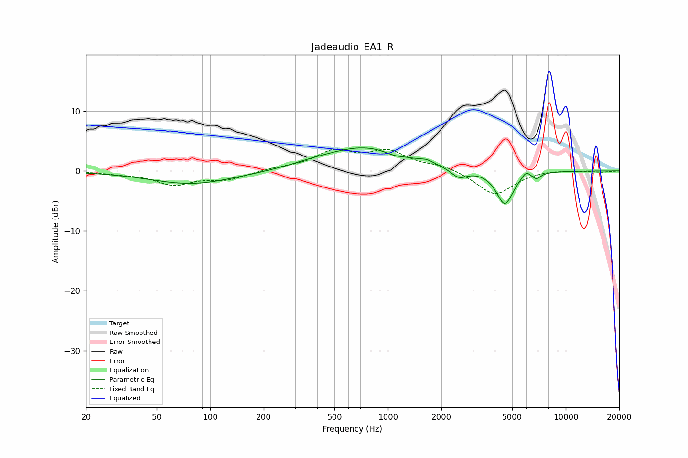

# Jadeaudio_EA1_R
See [usage instructions](https://github.com/jaakkopasanen/AutoEq#usage) for more options and info.

### Parametric EQs
Apply preamp of -3.9 dB when using parametric equalizer.

|   # | Type    |   Fc (Hz) |    Q |   Gain (dB) |
|-----|---------|-----------|------|-------------|
|   1 | Peaking |        79 | 0.6  |        -2.2 |
|   2 | Peaking |       357 | 1.28 |         0.4 |
|   3 | Peaking |       479 | 1.27 |         0.2 |
|   4 | Peaking |       747 | 0.66 |         3.9 |
|   5 | Peaking |      1079 | 2.75 |        -0.5 |
|   6 | Peaking |      1652 | 3.27 |         0.6 |
|   7 | Peaking |      2510 | 3.17 |        -1.5 |
|   8 | Peaking |      4544 | 2.95 |        -5.6 |
|   9 | Peaking |      5981 | 5.98 |         1   |
|  10 | Peaking |      6854 | 6    |        -0.9 |

### Fixed Band EQs
When using fixed band (also called graphic) equalizer, apply preamp of **-3.7 dB** (if available) and set gains manually with these parameters.

|   # | Type    |   Fc (Hz) |    Q |   Gain (dB) |
|-----|---------|-----------|------|-------------|
|   1 | Peaking |        31 | 1.41 |        -0.3 |
|   2 | Peaking |        62 | 1.41 |        -2.2 |
|   3 | Peaking |       125 | 1.41 |        -1.3 |
|   4 | Peaking |       250 | 1.41 |         0.4 |
|   5 | Peaking |       500 | 1.41 |         3.1 |
|   6 | Peaking |      1000 | 1.41 |         3   |
|   7 | Peaking |      2000 | 1.41 |         0.9 |
|   8 | Peaking |      4000 | 1.41 |        -4.1 |
|   9 | Peaking |      8000 | 1.41 |         0.3 |
|  10 | Peaking |     16000 | 1.41 |        -0.2 |

### Graphs

