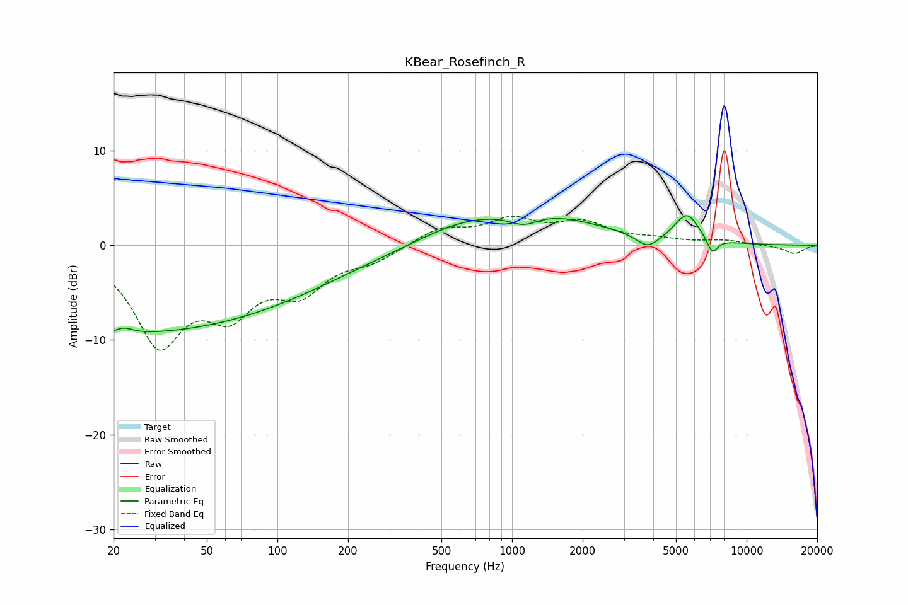

# KBear_Rosefinch_R
See [usage instructions](https://github.com/jaakkopasanen/AutoEq#usage) for more options and info.

### Parametric EQs
Apply preamp of -3.2 dB when using parametric equalizer.

|   # | Type    |   Fc (Hz) |    Q |   Gain (dB) |
|-----|---------|-----------|------|-------------|
|   1 | Peaking |        21 | 2.02 |        -6.6 |
|   2 | Peaking |        21 | 2.4  |         5.7 |
|   3 | Peaking |        28 | 0.32 |        -7.8 |
|   4 | Peaking |       112 | 0.44 |        -2.7 |
|   5 | Peaking |       606 | 0.73 |         1.6 |
|   6 | Peaking |      1120 | 2.24 |        -1.2 |
|   7 | Peaking |      1368 | 0.56 |         2.9 |
|   8 | Peaking |      3799 | 2.9  |        -1.4 |
|   9 | Peaking |      5570 | 2.67 |         3   |
|  10 | Peaking |      7142 | 5.78 |        -1.7 |

### Fixed Band EQs
When using fixed band (also called graphic) equalizer, apply preamp of **-3.2 dB** (if available) and set gains manually with these parameters.

|   # | Type    |   Fc (Hz) |    Q |   Gain (dB) |
|-----|---------|-----------|------|-------------|
|   1 | Peaking |        31 | 1.41 |        -9.8 |
|   2 | Peaking |        62 | 1.41 |        -5.8 |
|   3 | Peaking |       125 | 1.41 |        -4.2 |
|   4 | Peaking |       250 | 1.41 |        -1.4 |
|   5 | Peaking |       500 | 1.41 |         1.8 |
|   6 | Peaking |      1000 | 1.41 |         2.4 |
|   7 | Peaking |      2000 | 1.41 |         2.1 |
|   8 | Peaking |      4000 | 1.41 |         0.5 |
|   9 | Peaking |      8000 | 1.41 |         0.5 |
|  10 | Peaking |     16000 | 1.41 |        -0.9 |

### Graphs

