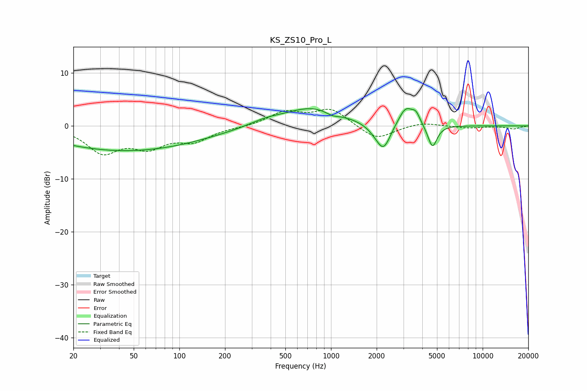

# KS_ZS10_Pro_L
See [usage instructions](https://github.com/jaakkopasanen/AutoEq#usage) for more options and info.

### Parametric EQs
Apply preamp of -3.4 dB when using parametric equalizer.

|   # | Type    |   Fc (Hz) |    Q |   Gain (dB) |
|-----|---------|-----------|------|-------------|
|   1 | Peaking |        32 | 0.37 |        -3.8 |
|   2 | Peaking |       102 | 0.46 |        -1.9 |
|   3 | Peaking |       368 | 1.27 |         0.9 |
|   4 | Peaking |       762 | 0.75 |         3.5 |
|   5 | Peaking |      1020 | 2.98 |        -0.8 |
|   6 | Peaking |      1989 | 2.49 |        -1   |
|   7 | Peaking |      2225 | 3.07 |        -4.5 |
|   8 | Peaking |      3120 | 2.89 |         3.6 |
|   9 | Peaking |      3641 | 5.44 |         1.7 |
|  10 | Peaking |      4666 | 4.6  |        -4.4 |

### Fixed Band EQs
When using fixed band (also called graphic) equalizer, apply preamp of **-3.2 dB** (if available) and set gains manually with these parameters.

|   # | Type    |   Fc (Hz) |    Q |   Gain (dB) |
|-----|---------|-----------|------|-------------|
|   1 | Peaking |        31 | 1.41 |        -4.7 |
|   2 | Peaking |        62 | 1.41 |        -3.5 |
|   3 | Peaking |       125 | 1.41 |        -2.6 |
|   4 | Peaking |       250 | 1.41 |        -0.2 |
|   5 | Peaking |       500 | 1.41 |         2.5 |
|   6 | Peaking |      1000 | 1.41 |         3.1 |
|   7 | Peaking |      2000 | 1.41 |        -2.7 |
|   8 | Peaking |      4000 | 1.41 |         0.7 |
|   9 | Peaking |      8000 | 1.41 |        -0.4 |
|  10 | Peaking |     16000 | 1.41 |        -0.6 |

### Graphs

