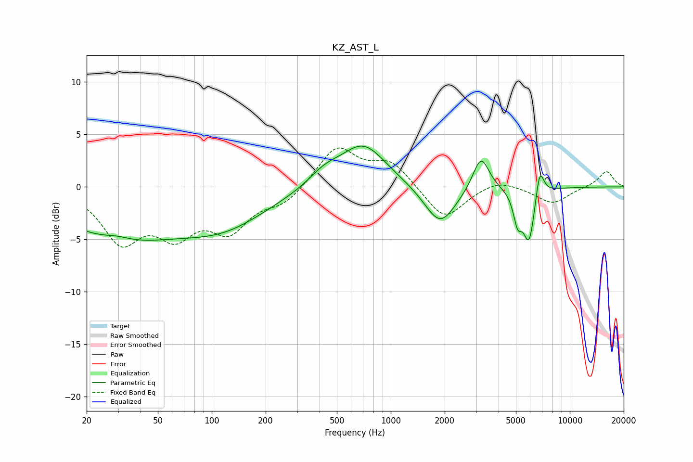

# KZ_AST_L
See [usage instructions](https://github.com/jaakkopasanen/AutoEq#usage) for more options and info.

### Parametric EQs
Apply preamp of -4.0 dB when using parametric equalizer.

|   # | Type    |   Fc (Hz) |    Q |   Gain (dB) |
|-----|---------|-----------|------|-------------|
|   1 | Peaking |        30 | 1.95 |         0.4 |
|   2 | Peaking |        30 | 0.41 |        -4.6 |
|   3 | Peaking |       118 | 0.57 |        -3.1 |
|   4 | Peaking |       424 | 1.58 |         1.2 |
|   5 | Peaking |       702 | 1.1  |         4.1 |
|   6 | Peaking |      1887 | 1.62 |        -3.8 |
|   7 | Peaking |      3189 | 3.08 |         3.4 |
|   8 | Peaking |      5112 | 5.87 |        -2.6 |
|   9 | Peaking |      5926 | 4.17 |        -5.2 |
|  10 | Peaking |      6786 | 5.82 |         3   |

### Fixed Band EQs
When using fixed band (also called graphic) equalizer, apply preamp of **-3.8 dB** (if available) and set gains manually with these parameters.

|   # | Type    |   Fc (Hz) |    Q |   Gain (dB) |
|-----|---------|-----------|------|-------------|
|   1 | Peaking |        31 | 1.41 |        -4.9 |
|   2 | Peaking |        62 | 1.41 |        -3.9 |
|   3 | Peaking |       125 | 1.41 |        -3.7 |
|   4 | Peaking |       250 | 1.41 |        -1.5 |
|   5 | Peaking |       500 | 1.41 |         3.8 |
|   6 | Peaking |      1000 | 1.41 |         2.3 |
|   7 | Peaking |      2000 | 1.41 |        -3.2 |
|   8 | Peaking |      4000 | 1.41 |         0.8 |
|   9 | Peaking |      8000 | 1.41 |        -1.6 |
|  10 | Peaking |     16000 | 1.41 |         1.5 |

### Graphs

