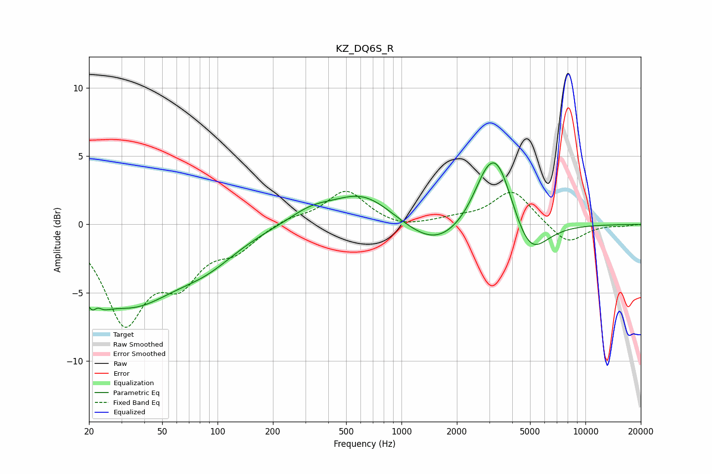

# KZ_DQ6S_R
See [usage instructions](https://github.com/jaakkopasanen/AutoEq#usage) for more options and info.

### Parametric EQs
Apply preamp of -4.6 dB when using parametric equalizer.

|   # | Type    |   Fc (Hz) |    Q |   Gain (dB) |
|-----|---------|-----------|------|-------------|
|   1 | Peaking |        22 | 3.41 |        -5.7 |
|   2 | Peaking |        22 | 4.36 |         4   |
|   3 | Peaking |        33 | 0.55 |        -5.5 |
|   4 | Peaking |        88 | 0.85 |        -1.6 |
|   5 | Peaking |       319 | 1.21 |         0.9 |
|   6 | Peaking |       617 | 0.84 |         2.3 |
|   7 | Peaking |      1529 | 0.86 |        -2   |
|   8 | Peaking |      2841 | 1.94 |         1.5 |
|   9 | Peaking |      3315 | 1.57 |         4.9 |
|  10 | Peaking |      4962 | 1.47 |        -2.9 |

### Fixed Band EQs
When using fixed band (also called graphic) equalizer, apply preamp of **-2.5 dB** (if available) and set gains manually with these parameters.

|   # | Type    |   Fc (Hz) |    Q |   Gain (dB) |
|-----|---------|-----------|------|-------------|
|   1 | Peaking |        31 | 1.41 |        -6.8 |
|   2 | Peaking |        62 | 1.41 |        -3.5 |
|   3 | Peaking |       125 | 1.41 |        -1.6 |
|   4 | Peaking |       250 | 1.41 |         0.5 |
|   5 | Peaking |       500 | 1.41 |         2.5 |
|   6 | Peaking |      1000 | 1.41 |        -0.4 |
|   7 | Peaking |      2000 | 1.41 |         0.3 |
|   8 | Peaking |      4000 | 1.41 |         2.5 |
|   9 | Peaking |      8000 | 1.41 |        -1.5 |
|  10 | Peaking |     16000 | 1.41 |        -0.1 |

### Graphs

