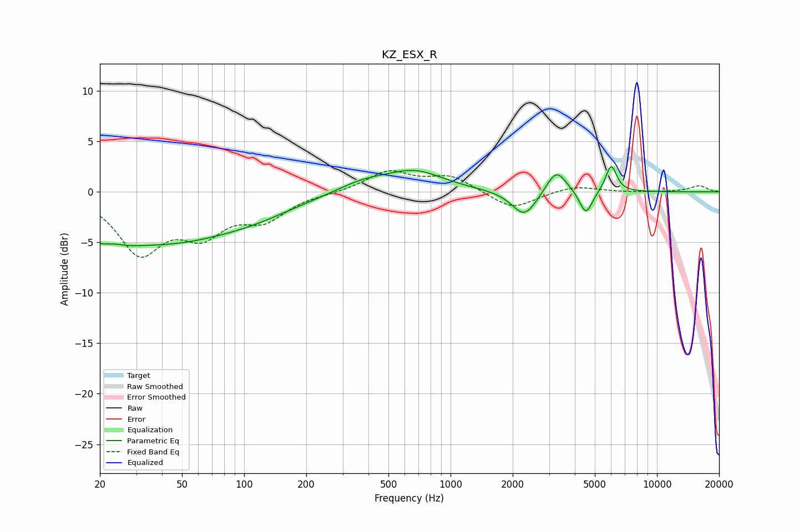

# KZ_ESX_R
See [usage instructions](https://github.com/jaakkopasanen/AutoEq#usage) for more options and info.

### Parametric EQs
Apply preamp of -2.6 dB when using parametric equalizer.

|   # | Type    |   Fc (Hz) |    Q |   Gain (dB) |
|-----|---------|-----------|------|-------------|
|   1 | Peaking |        22 | 1.42 |        -4.2 |
|   2 | Peaking |        23 | 2.03 |         2.2 |
|   3 | Peaking |        44 | 0.43 |        -4.4 |
|   4 | Peaking |       115 | 0.71 |        -1   |
|   5 | Peaking |       374 | 1.12 |         1   |
|   6 | Peaking |       670 | 1.01 |         2   |
|   7 | Peaking |      2278 | 2.36 |        -2.6 |
|   8 | Peaking |      3256 | 2.93 |         2.4 |
|   9 | Peaking |      4527 | 4.49 |        -2.4 |
|  10 | Peaking |      5998 | 5.2  |         2.7 |

### Fixed Band EQs
When using fixed band (also called graphic) equalizer, apply preamp of **-2.2 dB** (if available) and set gains manually with these parameters.

|   # | Type    |   Fc (Hz) |    Q |   Gain (dB) |
|-----|---------|-----------|------|-------------|
|   1 | Peaking |        31 | 1.41 |        -5.7 |
|   2 | Peaking |        62 | 1.41 |        -3.6 |
|   3 | Peaking |       125 | 1.41 |        -2.4 |
|   4 | Peaking |       250 | 1.41 |        -0.1 |
|   5 | Peaking |       500 | 1.41 |         2   |
|   6 | Peaking |      1000 | 1.41 |         1.5 |
|   7 | Peaking |      2000 | 1.41 |        -1.8 |
|   8 | Peaking |      4000 | 1.41 |         0.6 |
|   9 | Peaking |      8000 | 1.41 |        -0.1 |
|  10 | Peaking |     16000 | 1.41 |         0.6 |

### Graphs

