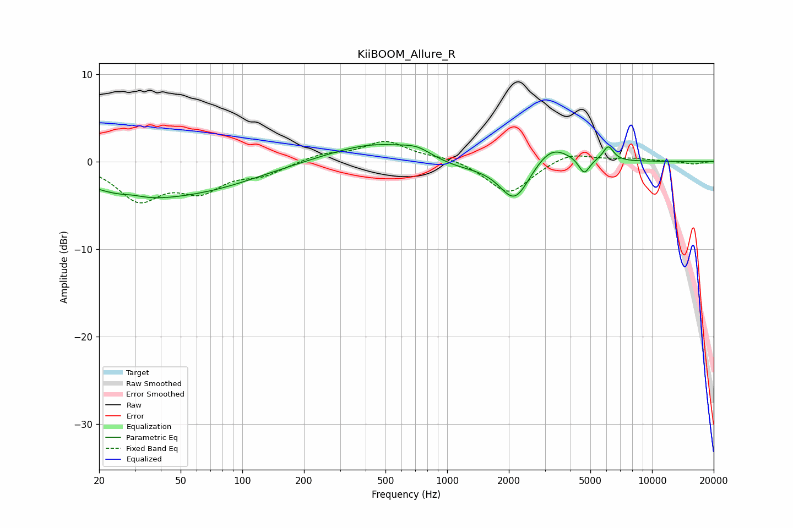

# KiiBOOM_Allure_R
See [usage instructions](https://github.com/jaakkopasanen/AutoEq#usage) for more options and info.

### Parametric EQs
Apply preamp of -2.0 dB when using parametric equalizer.

|   # | Type    |   Fc (Hz) |    Q |   Gain (dB) |
|-----|---------|-----------|------|-------------|
|   1 | Peaking |        29 | 0.56 |        -3.3 |
|   2 | Peaking |        29 | 2.62 |         0.3 |
|   3 | Peaking |        74 | 0.54 |        -2   |
|   4 | Peaking |       456 | 0.61 |         2.3 |
|   5 | Peaking |       717 | 2    |         0.8 |
|   6 | Peaking |      1089 | 0.86 |        -1.1 |
|   7 | Peaking |      2137 | 1.93 |        -4.5 |
|   8 | Peaking |      3225 | 1.65 |         2.3 |
|   9 | Peaking |      4665 | 5.33 |        -1.8 |
|  10 | Peaking |      6116 | 5.37 |         1.7 |

### Fixed Band EQs
When using fixed band (also called graphic) equalizer, apply preamp of **-2.4 dB** (if available) and set gains manually with these parameters.

|   # | Type    |   Fc (Hz) |    Q |   Gain (dB) |
|-----|---------|-----------|------|-------------|
|   1 | Peaking |        31 | 1.41 |        -4.1 |
|   2 | Peaking |        62 | 1.41 |        -2.9 |
|   3 | Peaking |       125 | 1.41 |        -1.3 |
|   4 | Peaking |       250 | 1.41 |         0.8 |
|   5 | Peaking |       500 | 1.41 |         2.2 |
|   6 | Peaking |      1000 | 1.41 |         0.5 |
|   7 | Peaking |      2000 | 1.41 |        -3.8 |
|   8 | Peaking |      4000 | 1.41 |         1.1 |
|   9 | Peaking |      8000 | 1.41 |         0.3 |
|  10 | Peaking |     16000 | 1.41 |        -0.3 |

### Graphs

