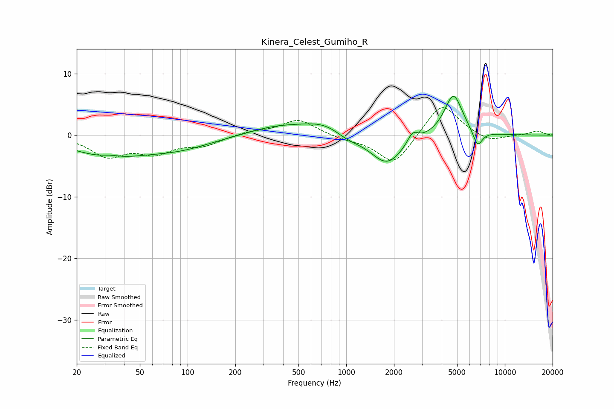

# Kinera_Celest_Gumiho_R
See [usage instructions](https://github.com/jaakkopasanen/AutoEq#usage) for more options and info.

### Parametric EQs
Apply preamp of -6.4 dB when using parametric equalizer.

|   # | Type    |   Fc (Hz) |    Q |   Gain (dB) |
|-----|---------|-----------|------|-------------|
|   1 | Peaking |        31 | 0.63 |        -3.2 |
|   2 | Peaking |        33 | 2.34 |         0.5 |
|   3 | Peaking |        88 | 0.67 |        -1.8 |
|   4 | Peaking |       358 | 0.8  |         1.3 |
|   5 | Peaking |       772 | 0.92 |         2.4 |
|   6 | Peaking |      1005 | 1.46 |        -1.6 |
|   7 | Peaking |      1806 | 1.36 |        -4.9 |
|   8 | Peaking |      2623 | 4.27 |         1.8 |
|   9 | Peaking |      4741 | 2.4  |         6.8 |
|  10 | Peaking |      6733 | 4.5  |        -2.7 |

### Fixed Band EQs
When using fixed band (also called graphic) equalizer, apply preamp of **-4.5 dB** (if available) and set gains manually with these parameters.

|   # | Type    |   Fc (Hz) |    Q |   Gain (dB) |
|-----|---------|-----------|------|-------------|
|   1 | Peaking |        31 | 1.41 |        -3.2 |
|   2 | Peaking |        62 | 1.41 |        -2.6 |
|   3 | Peaking |       125 | 1.41 |        -1.5 |
|   4 | Peaking |       250 | 1.41 |         0.6 |
|   5 | Peaking |       500 | 1.41 |         2.6 |
|   6 | Peaking |      1000 | 1.41 |        -0.6 |
|   7 | Peaking |      2000 | 1.41 |        -4.9 |
|   8 | Peaking |      4000 | 1.41 |         5.5 |
|   9 | Peaking |      8000 | 1.41 |        -1.2 |
|  10 | Peaking |     16000 | 1.41 |         0.7 |

### Graphs

