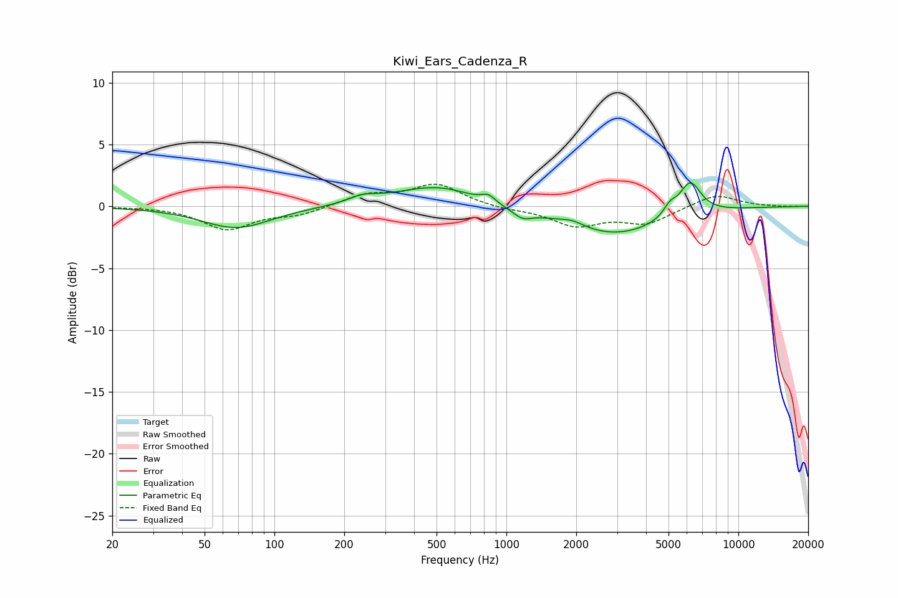

# Kiwi_Ears_Cadenza_R
See [usage instructions](https://github.com/jaakkopasanen/AutoEq#usage) for more options and info.

### Parametric EQs
Apply preamp of -2.0 dB when using parametric equalizer.

|   # | Type    |   Fc (Hz) |    Q |   Gain (dB) |
|-----|---------|-----------|------|-------------|
|   1 | Peaking |        69 | 0.95 |        -1.8 |
|   2 | Peaking |       241 | 2.26 |         0.5 |
|   3 | Peaking |       475 | 0.8  |         1.5 |
|   4 | Peaking |       566 | 1.44 |         0.2 |
|   5 | Peaking |       836 | 4.8  |         0.6 |
|   6 | Peaking |      1173 | 3.4  |        -0.7 |
|   7 | Peaking |      1921 | 2.79 |         0.4 |
|   8 | Peaking |      2928 | 0.65 |        -2.3 |
|   9 | Peaking |      5065 | 5.04 |         0.8 |
|  10 | Peaking |      6193 | 2.89 |         2.7 |

### Fixed Band EQs
When using fixed band (also called graphic) equalizer, apply preamp of **-1.9 dB** (if available) and set gains manually with these parameters.

|   # | Type    |   Fc (Hz) |    Q |   Gain (dB) |
|-----|---------|-----------|------|-------------|
|   1 | Peaking |        31 | 1.41 |         0   |
|   2 | Peaking |        62 | 1.41 |        -1.8 |
|   3 | Peaking |       125 | 1.41 |        -0.6 |
|   4 | Peaking |       250 | 1.41 |         0.9 |
|   5 | Peaking |       500 | 1.41 |         1.8 |
|   6 | Peaking |      1000 | 1.41 |        -0.2 |
|   7 | Peaking |      2000 | 1.41 |        -1.5 |
|   8 | Peaking |      4000 | 1.41 |        -1.3 |
|   9 | Peaking |      8000 | 1.41 |         1   |
|  10 | Peaking |     16000 | 1.41 |        -0   |

### Graphs

