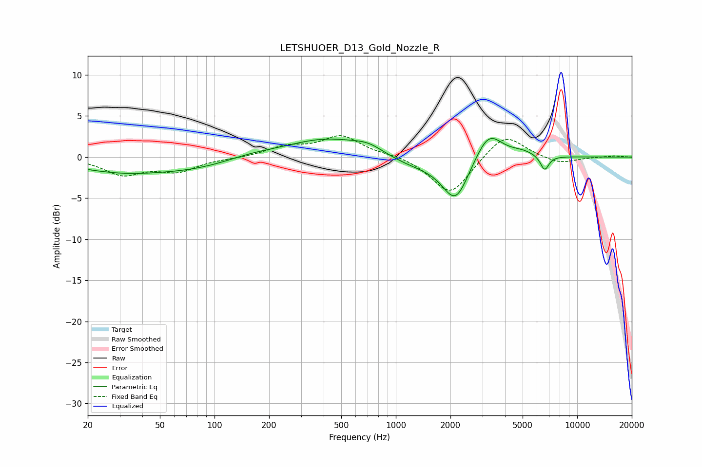

# LETSHUOER_D13_Gold_Nozzle_R
See [usage instructions](https://github.com/jaakkopasanen/AutoEq#usage) for more options and info.

### Parametric EQs
Apply preamp of -2.4 dB when using parametric equalizer.

|   # | Type    |   Fc (Hz) |    Q |   Gain (dB) |
|-----|---------|-----------|------|-------------|
|   1 | Peaking |        31 | 0.52 |        -1.7 |
|   2 | Peaking |        81 | 0.67 |        -0.9 |
|   3 | Peaking |       159 | 1.04 |         0.4 |
|   4 | Peaking |       420 | 0.63 |         2.3 |
|   5 | Peaking |       708 | 1.69 |         0.9 |
|   6 | Peaking |      1267 | 0.83 |        -1.2 |
|   7 | Peaking |      2136 | 1.94 |        -5.2 |
|   8 | Peaking |      3245 | 1.91 |         3.6 |
|   9 | Peaking |      5018 | 2.01 |         0.6 |
|  10 | Peaking |      6613 | 5.71 |        -1.8 |

### Fixed Band EQs
When using fixed band (also called graphic) equalizer, apply preamp of **-2.7 dB** (if available) and set gains manually with these parameters.

|   # | Type    |   Fc (Hz) |    Q |   Gain (dB) |
|-----|---------|-----------|------|-------------|
|   1 | Peaking |        31 | 1.41 |        -2   |
|   2 | Peaking |        62 | 1.41 |        -1.6 |
|   3 | Peaking |       125 | 1.41 |        -0.1 |
|   4 | Peaking |       250 | 1.41 |         1.2 |
|   5 | Peaking |       500 | 1.41 |         2.5 |
|   6 | Peaking |      1000 | 1.41 |         0.3 |
|   7 | Peaking |      2000 | 1.41 |        -4.7 |
|   8 | Peaking |      4000 | 1.41 |         3   |
|   9 | Peaking |      8000 | 1.41 |        -0.9 |
|  10 | Peaking |     16000 | 1.41 |         0.2 |

### Graphs

