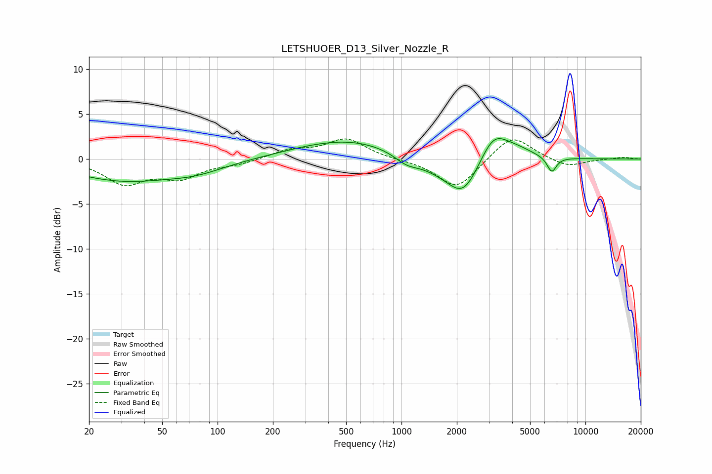

# LETSHUOER_D13_Silver_Nozzle_R
See [usage instructions](https://github.com/jaakkopasanen/AutoEq#usage) for more options and info.

### Parametric EQs
Apply preamp of -2.4 dB when using parametric equalizer.

|   # | Type    |   Fc (Hz) |    Q |   Gain (dB) |
|-----|---------|-----------|------|-------------|
|   1 | Peaking |        30 | 0.51 |        -2.3 |
|   2 | Peaking |        76 | 0.87 |        -1   |
|   3 | Peaking |       299 | 1.88 |         0   |
|   4 | Peaking |       525 | 0.49 |         2.2 |
|   5 | Peaking |      1062 | 2.16 |        -0.9 |
|   6 | Peaking |      1618 | 0.95 |        -1.3 |
|   7 | Peaking |      2175 | 1.64 |        -3.8 |
|   8 | Peaking |      3160 | 1.83 |         3.2 |
|   9 | Peaking |      4230 | 1.5  |         0.9 |
|  10 | Peaking |      6560 | 5.33 |        -1.7 |

### Fixed Band EQs
When using fixed band (also called graphic) equalizer, apply preamp of **-2.3 dB** (if available) and set gains manually with these parameters.

|   # | Type    |   Fc (Hz) |    Q |   Gain (dB) |
|-----|---------|-----------|------|-------------|
|   1 | Peaking |        31 | 1.41 |        -2.6 |
|   2 | Peaking |        62 | 1.41 |        -1.9 |
|   3 | Peaking |       125 | 1.41 |        -0.5 |
|   4 | Peaking |       250 | 1.41 |         0.9 |
|   5 | Peaking |       500 | 1.41 |         2.2 |
|   6 | Peaking |      1000 | 1.41 |        -0.1 |
|   7 | Peaking |      2000 | 1.41 |        -3.4 |
|   8 | Peaking |      4000 | 1.41 |         2.8 |
|   9 | Peaking |      8000 | 1.41 |        -0.9 |
|  10 | Peaking |     16000 | 1.41 |         0.2 |

### Graphs

