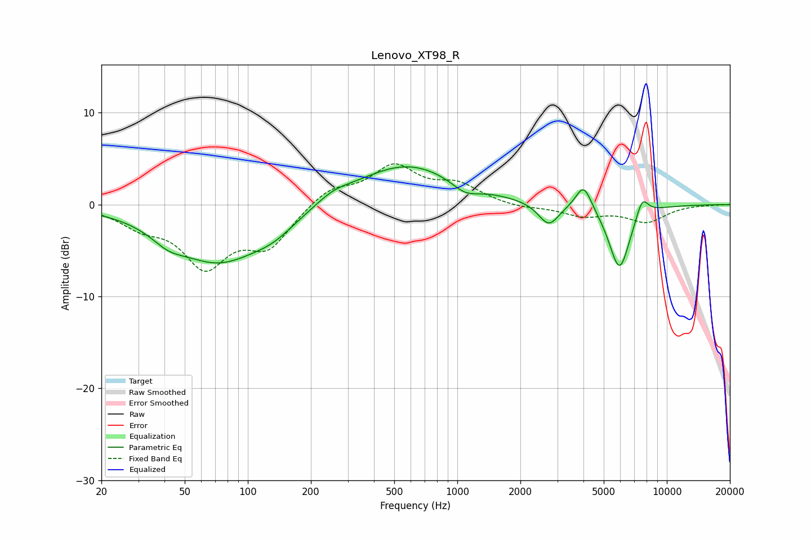

# Lenovo_XT98_R
See [usage instructions](https://github.com/jaakkopasanen/AutoEq#usage) for more options and info.

### Parametric EQs
Apply preamp of -4.2 dB when using parametric equalizer.

|   # | Type    |   Fc (Hz) |    Q |   Gain (dB) |
|-----|---------|-----------|------|-------------|
|   1 | Peaking |        42 | 1.86 |        -1.2 |
|   2 | Peaking |        72 | 0.66 |        -6   |
|   3 | Peaking |       133 | 1.31 |        -1.4 |
|   4 | Peaking |       256 | 1.78 |         0.8 |
|   5 | Peaking |       573 | 0.57 |         4.5 |
|   6 | Peaking |      1091 | 2.15 |        -1.2 |
|   7 | Peaking |      2731 | 2.88 |        -2.5 |
|   8 | Peaking |      4011 | 3.67 |         2.8 |
|   9 | Peaking |      5943 | 2.69 |        -7.2 |
|  10 | Peaking |      7630 | 4.52 |         2.2 |

### Fixed Band EQs
When using fixed band (also called graphic) equalizer, apply preamp of **-4.5 dB** (if available) and set gains manually with these parameters.

|   # | Type    |   Fc (Hz) |    Q |   Gain (dB) |
|-----|---------|-----------|------|-------------|
|   1 | Peaking |        31 | 1.41 |        -1.9 |
|   2 | Peaking |        62 | 1.41 |        -6.2 |
|   3 | Peaking |       125 | 1.41 |        -4.2 |
|   4 | Peaking |       250 | 1.41 |         1.8 |
|   5 | Peaking |       500 | 1.41 |         4   |
|   6 | Peaking |      1000 | 1.41 |         1.9 |
|   7 | Peaking |      2000 | 1.41 |        -0.4 |
|   8 | Peaking |      4000 | 1.41 |        -1.2 |
|   9 | Peaking |      8000 | 1.41 |        -1.8 |
|  10 | Peaking |     16000 | 1.41 |        -0   |

### Graphs

