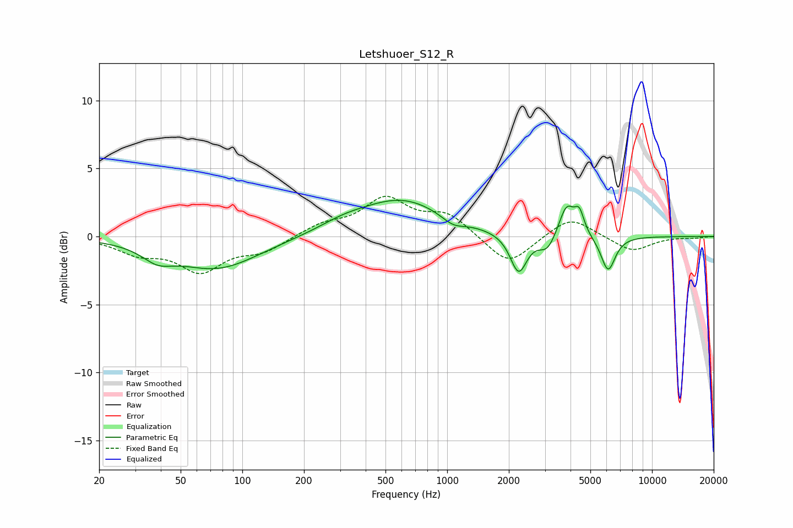

# Letshuoer_S12_R
See [usage instructions](https://github.com/jaakkopasanen/AutoEq#usage) for more options and info.

### Parametric EQs
Apply preamp of -2.8 dB when using parametric equalizer.

|   # | Type    |   Fc (Hz) |    Q |   Gain (dB) |
|-----|---------|-----------|------|-------------|
|   1 | Peaking |        39 | 1.93 |        -1   |
|   2 | Peaking |        75 | 0.69 |        -2.4 |
|   3 | Peaking |       311 | 1.17 |         0.5 |
|   4 | Peaking |       600 | 0.67 |         2.7 |
|   5 | Peaking |      1067 | 2.54 |        -0.6 |
|   6 | Peaking |      2232 | 3.49 |        -2.9 |
|   7 | Peaking |      3084 | 3.47 |        -1.2 |
|   8 | Peaking |      3830 | 3.74 |         2.3 |
|   9 | Peaking |      4418 | 5.98 |         1.5 |
|  10 | Peaking |      6102 | 3.95 |        -2.6 |

### Fixed Band EQs
When using fixed band (also called graphic) equalizer, apply preamp of **-3.0 dB** (if available) and set gains manually with these parameters.

|   # | Type    |   Fc (Hz) |    Q |   Gain (dB) |
|-----|---------|-----------|------|-------------|
|   1 | Peaking |        31 | 1.41 |        -1.1 |
|   2 | Peaking |        62 | 1.41 |        -2.4 |
|   3 | Peaking |       125 | 1.41 |        -1   |
|   4 | Peaking |       250 | 1.41 |         0.8 |
|   5 | Peaking |       500 | 1.41 |         2.6 |
|   6 | Peaking |      1000 | 1.41 |         1.5 |
|   7 | Peaking |      2000 | 1.41 |        -2.2 |
|   8 | Peaking |      4000 | 1.41 |         1.5 |
|   9 | Peaking |      8000 | 1.41 |        -1.1 |
|  10 | Peaking |     16000 | 1.41 |        -0.1 |

### Graphs

