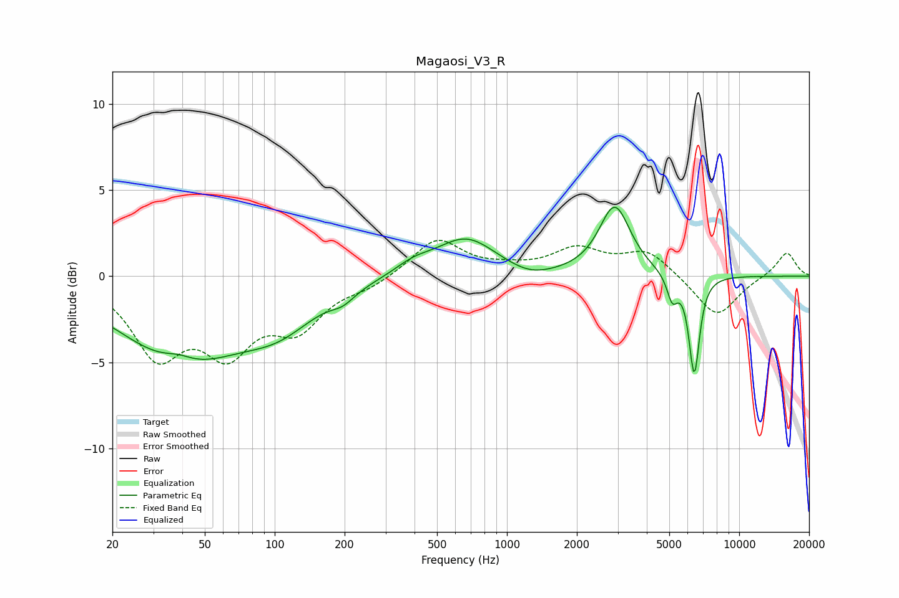

# Magaosi_V3_R
See [usage instructions](https://github.com/jaakkopasanen/AutoEq#usage) for more options and info.

### Parametric EQs
Apply preamp of -4.1 dB when using parametric equalizer.

|   # | Type    |   Fc (Hz) |    Q |   Gain (dB) |
|-----|---------|-----------|------|-------------|
|   1 | Peaking |        38 | 2.25 |         0.5 |
|   2 | Peaking |        40 | 0.52 |        -4.7 |
|   3 | Peaking |       105 | 0.9  |        -1.8 |
|   4 | Peaking |       197 | 2.75 |        -0.6 |
|   5 | Peaking |       395 | 1.75 |         0.6 |
|   6 | Peaking |       667 | 1.09 |         2.2 |
|   7 | Peaking |      1255 | 1.46 |        -0.5 |
|   8 | Peaking |      2912 | 2.12 |         4   |
|   9 | Peaking |      5154 | 6    |        -1.5 |
|  10 | Peaking |      6406 | 6    |        -5.7 |

### Fixed Band EQs
When using fixed band (also called graphic) equalizer, apply preamp of **-2.2 dB** (if available) and set gains manually with these parameters.

|   # | Type    |   Fc (Hz) |    Q |   Gain (dB) |
|-----|---------|-----------|------|-------------|
|   1 | Peaking |        31 | 1.41 |        -4.3 |
|   2 | Peaking |        62 | 1.41 |        -3.8 |
|   3 | Peaking |       125 | 1.41 |        -2.7 |
|   4 | Peaking |       250 | 1.41 |        -0.5 |
|   5 | Peaking |       500 | 1.41 |         2.2 |
|   6 | Peaking |      1000 | 1.41 |         0.3 |
|   7 | Peaking |      2000 | 1.41 |         1.5 |
|   8 | Peaking |      4000 | 1.41 |         1.4 |
|   9 | Peaking |      8000 | 1.41 |        -2.4 |
|  10 | Peaking |     16000 | 1.41 |         1.4 |

### Graphs

