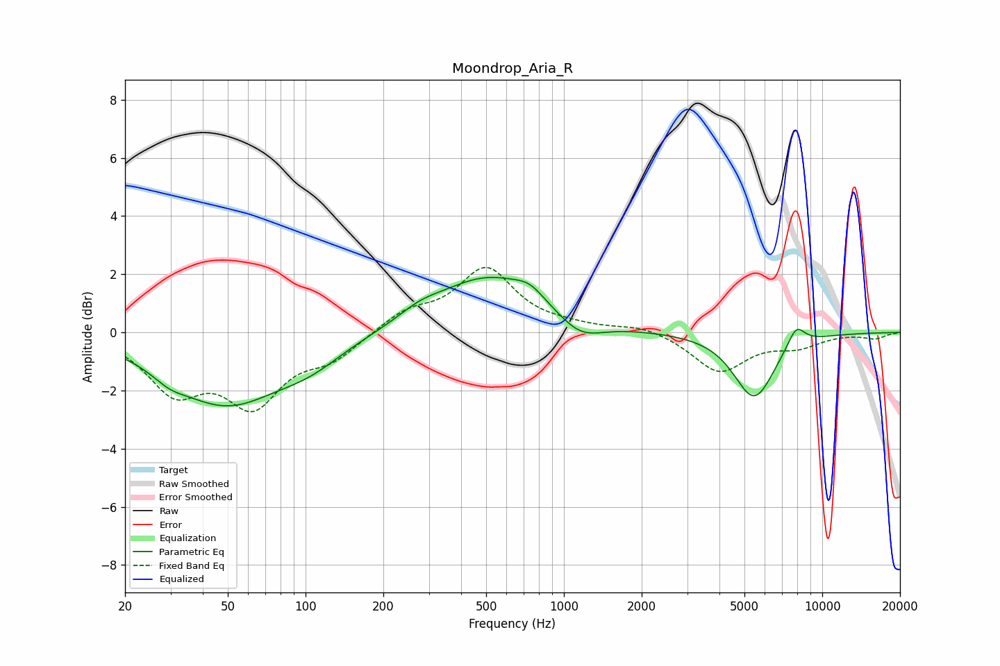

# Moondrop_Aria_R
See [usage instructions](https://github.com/jaakkopasanen/AutoEq#usage) for more options and info.

### Parametric EQs
Apply preamp of -2.0 dB when using parametric equalizer.

|   # | Type    |   Fc (Hz) |    Q |   Gain (dB) |
|-----|---------|-----------|------|-------------|
|   1 | Peaking |        30 | 2.25 |        -0.3 |
|   2 | Peaking |        49 | 0.67 |        -2.4 |
|   3 | Peaking |       104 | 1.07 |        -0.6 |
|   4 | Peaking |       276 | 1.76 |         0.3 |
|   5 | Peaking |       511 | 0.7  |         1.9 |
|   6 | Peaking |       738 | 2.49 |         0.4 |
|   7 | Peaking |      1155 | 1.65 |        -0.7 |
|   8 | Peaking |      1411 | 1.11 |        -0   |
|   9 | Peaking |      5451 | 1.75 |        -2.3 |
|  10 | Peaking |      7926 | 3.86 |         0.7 |

### Fixed Band EQs
When using fixed band (also called graphic) equalizer, apply preamp of **-2.3 dB** (if available) and set gains manually with these parameters.

|   # | Type    |   Fc (Hz) |    Q |   Gain (dB) |
|-----|---------|-----------|------|-------------|
|   1 | Peaking |        31 | 1.41 |        -1.9 |
|   2 | Peaking |        62 | 1.41 |        -2.3 |
|   3 | Peaking |       125 | 1.41 |        -0.8 |
|   4 | Peaking |       250 | 1.41 |         0.7 |
|   5 | Peaking |       500 | 1.41 |         2.1 |
|   6 | Peaking |      1000 | 1.41 |         0.1 |
|   7 | Peaking |      2000 | 1.41 |         0.2 |
|   8 | Peaking |      4000 | 1.41 |        -1.3 |
|   9 | Peaking |      8000 | 1.41 |        -0.4 |
|  10 | Peaking |     16000 | 1.41 |        -0.2 |

### Graphs

