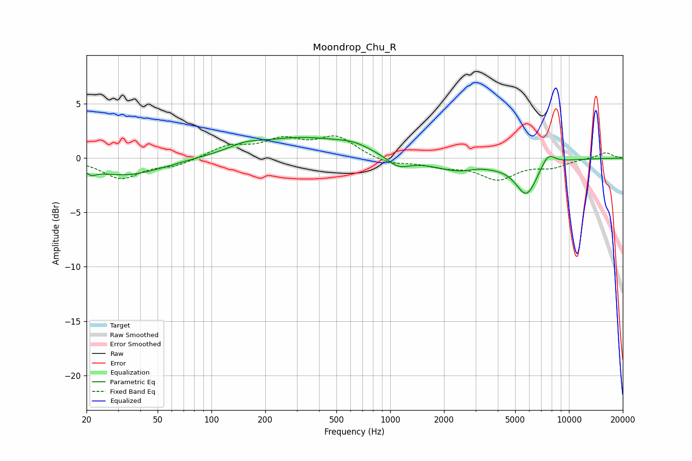

# Moondrop_Chu_R
See [usage instructions](https://github.com/jaakkopasanen/AutoEq#usage) for more options and info.

### Parametric EQs
Apply preamp of -2.0 dB when using parametric equalizer.

|   # | Type    |   Fc (Hz) |    Q |   Gain (dB) |
|-----|---------|-----------|------|-------------|
|   1 | Peaking |        21 | 5.81 |        -0.4 |
|   2 | Peaking |        33 | 0.65 |        -1.6 |
|   3 | Peaking |       153 | 1.87 |         0.4 |
|   4 | Peaking |       321 | 0.46 |         1.9 |
|   5 | Peaking |       623 | 1.7  |         0.4 |
|   6 | Peaking |      1109 | 2.15 |        -1   |
|   7 | Peaking |      2556 | 0.84 |        -1.3 |
|   8 | Peaking |      3096 | 2.11 |         0.4 |
|   9 | Peaking |      5787 | 2.28 |        -3.1 |
|  10 | Peaking |      7627 | 3.36 |         1.2 |

### Fixed Band EQs
When using fixed band (also called graphic) equalizer, apply preamp of **-2.2 dB** (if available) and set gains manually with these parameters.

|   # | Type    |   Fc (Hz) |    Q |   Gain (dB) |
|-----|---------|-----------|------|-------------|
|   1 | Peaking |        31 | 1.41 |        -1.8 |
|   2 | Peaking |        62 | 1.41 |        -0.6 |
|   3 | Peaking |       125 | 1.41 |         1.1 |
|   4 | Peaking |       250 | 1.41 |         1.5 |
|   5 | Peaking |       500 | 1.41 |         1.9 |
|   6 | Peaking |      1000 | 1.41 |        -0.6 |
|   7 | Peaking |      2000 | 1.41 |        -0.6 |
|   8 | Peaking |      4000 | 1.41 |        -1.8 |
|   9 | Peaking |      8000 | 1.41 |        -0.7 |
|  10 | Peaking |     16000 | 1.41 |         0.5 |

### Graphs

