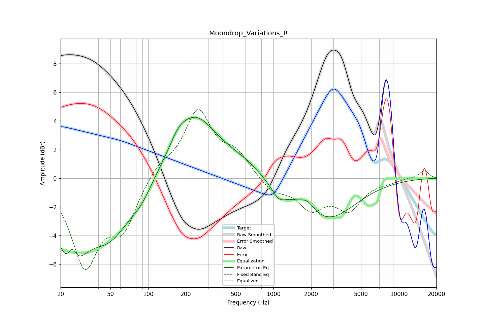

# Moondrop_Variations_R
See [usage instructions](https://github.com/jaakkopasanen/AutoEq#usage) for more options and info.

### Parametric EQs
Apply preamp of -4.3 dB when using parametric equalizer.

|   # | Type    |   Fc (Hz) |    Q |   Gain (dB) |
|-----|---------|-----------|------|-------------|
|   1 | Peaking |        24 | 1.35 |        -5.3 |
|   2 | Peaking |        25 | 3.98 |         1.7 |
|   3 | Peaking |        49 | 0.79 |        -3.7 |
|   4 | Peaking |        88 | 1.75 |        -0.7 |
|   5 | Peaking |       173 | 2.23 |         0.7 |
|   6 | Peaking |       234 | 0.8  |         4.3 |
|   7 | Peaking |       549 | 0.95 |         0.8 |
|   8 | Peaking |      1101 | 2.41 |        -0.9 |
|   9 | Peaking |      1863 | 2.63 |         0.7 |
|  10 | Peaking |      2653 | 0.63 |        -2.9 |

### Fixed Band EQs
When using fixed band (also called graphic) equalizer, apply preamp of **-4.9 dB** (if available) and set gains manually with these parameters.

|   # | Type    |   Fc (Hz) |    Q |   Gain (dB) |
|-----|---------|-----------|------|-------------|
|   1 | Peaking |        31 | 1.41 |        -5.9 |
|   2 | Peaking |        62 | 1.41 |        -3.2 |
|   3 | Peaking |       125 | 1.41 |         1   |
|   4 | Peaking |       250 | 1.41 |         4.5 |
|   5 | Peaking |       500 | 1.41 |         1.5 |
|   6 | Peaking |      1000 | 1.41 |        -0.9 |
|   7 | Peaking |      2000 | 1.41 |        -1.9 |
|   8 | Peaking |      4000 | 1.41 |        -2   |
|   9 | Peaking |      8000 | 1.41 |        -0.2 |
|  10 | Peaking |     16000 | 1.41 |         0.5 |

### Graphs

