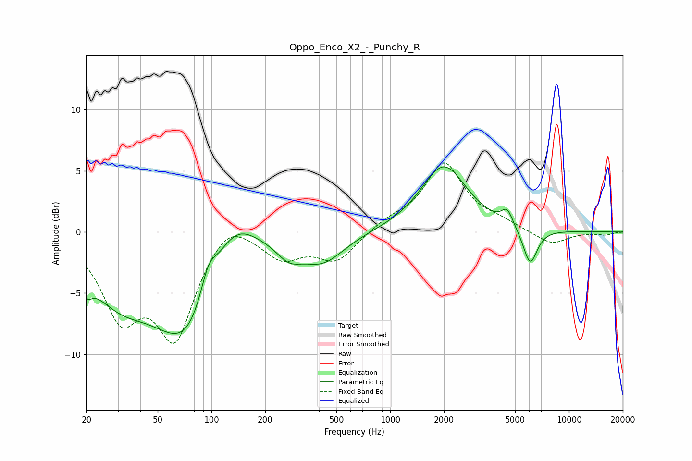

# Oppo_Enco_X2_-_Punchy_R
See [usage instructions](https://github.com/jaakkopasanen/AutoEq#usage) for more options and info.

### Parametric EQs
Apply preamp of -5.4 dB when using parametric equalizer.

|   # | Type    |   Fc (Hz) |    Q |   Gain (dB) |
|-----|---------|-----------|------|-------------|
|   1 | Peaking |        20 | 4.8  |        -1.4 |
|   2 | Peaking |        30 | 0.8  |        -3.9 |
|   3 | Peaking |        75 | 0.71 |        -9.1 |
|   4 | Peaking |        96 | 3.09 |         2.4 |
|   5 | Peaking |       130 | 1.03 |         4.9 |
|   6 | Peaking |       272 | 2.03 |        -1.3 |
|   7 | Peaking |       419 | 1.16 |        -2.3 |
|   8 | Peaking |      1993 | 1.11 |         5.4 |
|   9 | Peaking |      4514 | 4.4  |         1.3 |
|  10 | Peaking |      6066 | 3.44 |        -3   |

### Fixed Band EQs
When using fixed band (also called graphic) equalizer, apply preamp of **-5.7 dB** (if available) and set gains manually with these parameters.

|   # | Type    |   Fc (Hz) |    Q |   Gain (dB) |
|-----|---------|-----------|------|-------------|
|   1 | Peaking |        31 | 1.41 |        -6.2 |
|   2 | Peaking |        62 | 1.41 |        -8.1 |
|   3 | Peaking |       125 | 1.41 |         1.7 |
|   4 | Peaking |       250 | 1.41 |        -2   |
|   5 | Peaking |       500 | 1.41 |        -2.3 |
|   6 | Peaking |      1000 | 1.41 |         0.8 |
|   7 | Peaking |      2000 | 1.41 |         5.5 |
|   8 | Peaking |      4000 | 1.41 |         0.6 |
|   9 | Peaking |      8000 | 1.41 |        -1.1 |
|  10 | Peaking |     16000 | 1.41 |        -0.2 |

### Graphs

