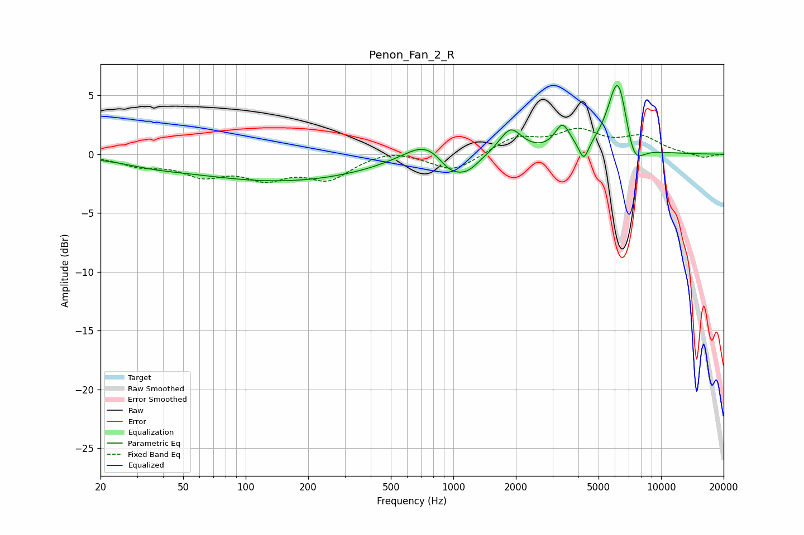

# Penon_Fan_2_R
See [usage instructions](https://github.com/jaakkopasanen/AutoEq#usage) for more options and info.

### Parametric EQs
Apply preamp of -5.9 dB when using parametric equalizer.

|   # | Type    |   Fc (Hz) |    Q |   Gain (dB) |
|-----|---------|-----------|------|-------------|
|   1 | Peaking |        36 | 0.94 |        -0.4 |
|   2 | Peaking |       151 | 0.32 |        -2.3 |
|   3 | Peaking |       762 | 1.28 |         2   |
|   4 | Peaking |       959 | 2.08 |        -1.8 |
|   5 | Peaking |      1172 | 2.26 |        -1.2 |
|   6 | Peaking |      1885 | 2.64 |         2.2 |
|   7 | Peaking |      3353 | 3.87 |         2.1 |
|   8 | Peaking |      4248 | 6    |        -1.6 |
|   9 | Peaking |      6213 | 2.77 |         7   |
|  10 | Peaking |      7340 | 2.87 |        -2.8 |

### Fixed Band EQs
When using fixed band (also called graphic) equalizer, apply preamp of **-2.3 dB** (if available) and set gains manually with these parameters.

|   # | Type    |   Fc (Hz) |    Q |   Gain (dB) |
|-----|---------|-----------|------|-------------|
|   1 | Peaking |        31 | 1.41 |        -0.8 |
|   2 | Peaking |        62 | 1.41 |        -1.6 |
|   3 | Peaking |       125 | 1.41 |        -1.7 |
|   4 | Peaking |       250 | 1.41 |        -1.9 |
|   5 | Peaking |       500 | 1.41 |         0.5 |
|   6 | Peaking |      1000 | 1.41 |        -1.5 |
|   7 | Peaking |      2000 | 1.41 |         1.4 |
|   8 | Peaking |      4000 | 1.41 |         1.8 |
|   9 | Peaking |      8000 | 1.41 |         1.4 |
|  10 | Peaking |     16000 | 1.41 |        -0.3 |

### Graphs

