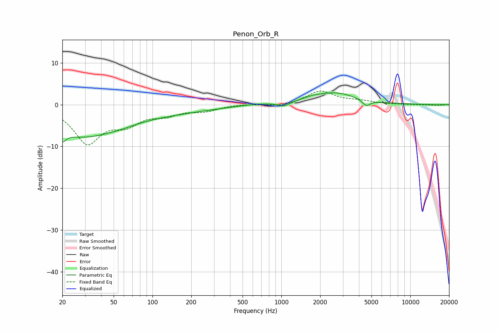

# Penon_Orb_R
See [usage instructions](https://github.com/jaakkopasanen/AutoEq#usage) for more options and info.

### Parametric EQs
Apply preamp of -2.9 dB when using parametric equalizer.

|   # | Type    |   Fc (Hz) |    Q |   Gain (dB) |
|-----|---------|-----------|------|-------------|
|   1 | Peaking |        20 | 5.4  |        -5.9 |
|   2 | Peaking |        20 | 5.79 |         3.3 |
|   3 | Peaking |        28 | 0.53 |        -6.7 |
|   4 | Peaking |        57 | 1.53 |        -0.4 |
|   5 | Peaking |       102 | 0.34 |        -1.9 |
|   6 | Peaking |       630 | 1.22 |         0.3 |
|   7 | Peaking |      1044 | 3.25 |        -1   |
|   8 | Peaking |      1724 | 1.9  |         0.5 |
|   9 | Peaking |      2611 | 0.84 |         2.8 |
|  10 | Peaking |      4562 | 4.48 |        -1.5 |

### Fixed Band EQs
When using fixed band (also called graphic) equalizer, apply preamp of **-3.3 dB** (if available) and set gains manually with these parameters.

|   # | Type    |   Fc (Hz) |    Q |   Gain (dB) |
|-----|---------|-----------|------|-------------|
|   1 | Peaking |        31 | 1.41 |        -8.8 |
|   2 | Peaking |        62 | 1.41 |        -3.8 |
|   3 | Peaking |       125 | 1.41 |        -2   |
|   4 | Peaking |       250 | 1.41 |        -1.3 |
|   5 | Peaking |       500 | 1.41 |         0.2 |
|   6 | Peaking |      1000 | 1.41 |        -0.5 |
|   7 | Peaking |      2000 | 1.41 |         3.2 |
|   8 | Peaking |      4000 | 1.41 |         0.7 |
|   9 | Peaking |      8000 | 1.41 |        -0   |
|  10 | Peaking |     16000 | 1.41 |        -0.2 |

### Graphs

