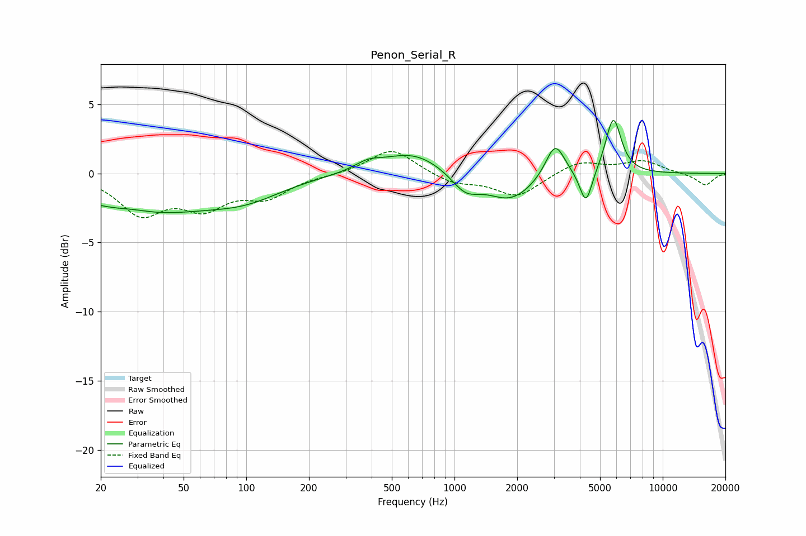

# Penon_Serial_R
See [usage instructions](https://github.com/jaakkopasanen/AutoEq#usage) for more options and info.

### Parametric EQs
Apply preamp of -3.9 dB when using parametric equalizer.

|   # | Type    |   Fc (Hz) |    Q |   Gain (dB) |
|-----|---------|-----------|------|-------------|
|   1 | Peaking |        29 | 1.72 |         0.2 |
|   2 | Peaking |        33 | 0.4  |        -2.7 |
|   3 | Peaking |       101 | 0.81 |        -1.1 |
|   4 | Peaking |       383 | 2.2  |         0.6 |
|   5 | Peaking |       633 | 0.94 |         1.6 |
|   6 | Peaking |      1128 | 2.04 |        -1.4 |
|   7 | Peaking |      1858 | 1.24 |        -1.9 |
|   8 | Peaking |      3042 | 3.05 |         2.6 |
|   9 | Peaking |      4279 | 4.69 |        -2.5 |
|  10 | Peaking |      5791 | 3.7  |         4.1 |

### Fixed Band EQs
When using fixed band (also called graphic) equalizer, apply preamp of **-1.7 dB** (if available) and set gains manually with these parameters.

|   # | Type    |   Fc (Hz) |    Q |   Gain (dB) |
|-----|---------|-----------|------|-------------|
|   1 | Peaking |        31 | 1.41 |        -2.7 |
|   2 | Peaking |        62 | 1.41 |        -2.2 |
|   3 | Peaking |       125 | 1.41 |        -1.5 |
|   4 | Peaking |       250 | 1.41 |        -0.1 |
|   5 | Peaking |       500 | 1.41 |         1.8 |
|   6 | Peaking |      1000 | 1.41 |        -0.7 |
|   7 | Peaking |      2000 | 1.41 |        -1.7 |
|   8 | Peaking |      4000 | 1.41 |         0.9 |
|   9 | Peaking |      8000 | 1.41 |         0.9 |
|  10 | Peaking |     16000 | 1.41 |        -0.9 |

### Graphs

