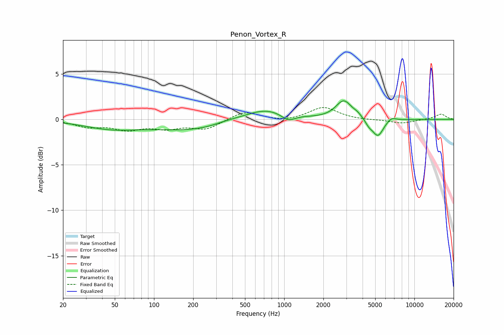

# Penon_Vortex_R
See [usage instructions](https://github.com/jaakkopasanen/AutoEq#usage) for more options and info.

### Parametric EQs
Apply preamp of -2.1 dB when using parametric equalizer.

|   # | Type    |   Fc (Hz) |    Q |   Gain (dB) |
|-----|---------|-----------|------|-------------|
|   1 | Peaking |        47 | 0.67 |        -0.9 |
|   2 | Peaking |       214 | 0.44 |        -1.2 |
|   3 | Peaking |       363 | 1.19 |         0.4 |
|   4 | Peaking |       705 | 0.86 |         1.3 |
|   5 | Peaking |      1072 | 2.78 |        -0.8 |
|   6 | Peaking |      2868 | 2.31 |         2   |
|   7 | Peaking |      3661 | 4.42 |         0.3 |
|   8 | Peaking |      4467 | 5.42 |        -0.5 |
|   9 | Peaking |      5235 | 3.2  |        -1.9 |
|  10 | Peaking |      6669 | 4.03 |         0.4 |

### Fixed Band EQs
When using fixed band (also called graphic) equalizer, apply preamp of **-1.4 dB** (if available) and set gains manually with these parameters.

|   # | Type    |   Fc (Hz) |    Q |   Gain (dB) |
|-----|---------|-----------|------|-------------|
|   1 | Peaking |        31 | 1.41 |        -0.7 |
|   2 | Peaking |        62 | 1.41 |        -1   |
|   3 | Peaking |       125 | 1.41 |        -0.8 |
|   4 | Peaking |       250 | 1.41 |        -1   |
|   5 | Peaking |       500 | 1.41 |         0.9 |
|   6 | Peaking |      1000 | 1.41 |        -0.3 |
|   7 | Peaking |      2000 | 1.41 |         1.4 |
|   8 | Peaking |      4000 | 1.41 |        -0.1 |
|   9 | Peaking |      8000 | 1.41 |        -0.4 |
|  10 | Peaking |     16000 | 1.41 |         0.6 |

### Graphs

