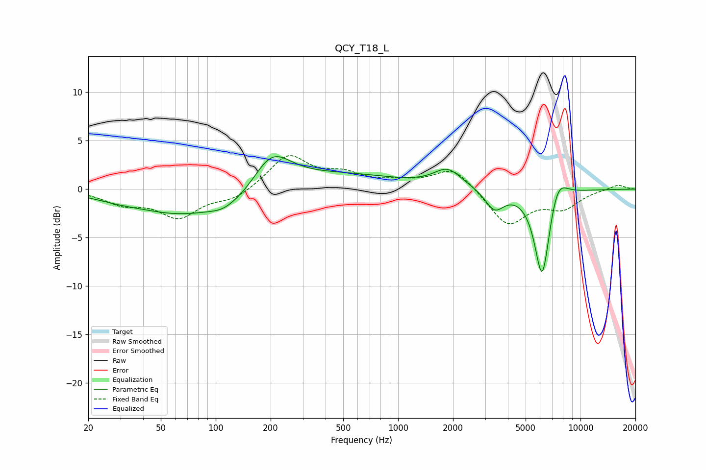

# QCY_T18_L
See [usage instructions](https://github.com/jaakkopasanen/AutoEq#usage) for more options and info.

### Parametric EQs
Apply preamp of -3.5 dB when using parametric equalizer.

|   # | Type    |   Fc (Hz) |    Q |   Gain (dB) |
|-----|---------|-----------|------|-------------|
|   1 | Peaking |        29 | 1.07 |        -0.4 |
|   2 | Peaking |        65 | 0.57 |        -2.4 |
|   3 | Peaking |       109 | 2.19 |        -0.5 |
|   4 | Peaking |       144 | 0.95 |        -1.5 |
|   5 | Peaking |       201 | 1.3  |         4.2 |
|   6 | Peaking |       478 | 0.43 |         1.5 |
|   7 | Peaking |      1869 | 1.87 |         1.8 |
|   8 | Peaking |      3378 | 2.74 |        -2.1 |
|   9 | Peaking |      6168 | 3.21 |        -9.5 |
|  10 | Peaking |      7481 | 2.63 |         2.6 |

### Fixed Band EQs
When using fixed band (also called graphic) equalizer, apply preamp of **-3.6 dB** (if available) and set gains manually with these parameters.

|   # | Type    |   Fc (Hz) |    Q |   Gain (dB) |
|-----|---------|-----------|------|-------------|
|   1 | Peaking |        31 | 1.41 |        -1.3 |
|   2 | Peaking |        62 | 1.41 |        -2.7 |
|   3 | Peaking |       125 | 1.41 |        -1   |
|   4 | Peaking |       250 | 1.41 |         3.5 |
|   5 | Peaking |       500 | 1.41 |         1.3 |
|   6 | Peaking |      1000 | 1.41 |         0.6 |
|   7 | Peaking |      2000 | 1.41 |         2.3 |
|   8 | Peaking |      4000 | 1.41 |        -3.7 |
|   9 | Peaking |      8000 | 1.41 |        -1.8 |
|  10 | Peaking |     16000 | 1.41 |         0.5 |

### Graphs

