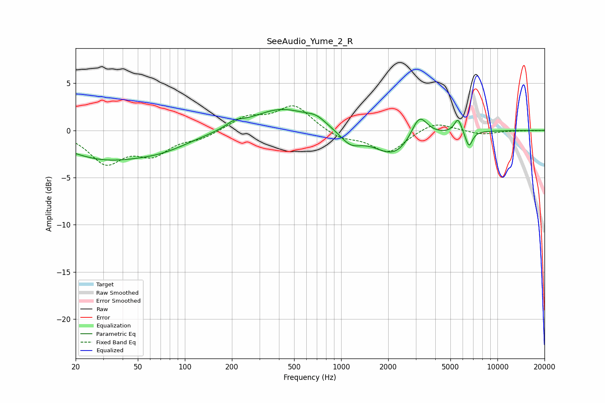

# SeeAudio_Yume_2_R
See [usage instructions](https://github.com/jaakkopasanen/AutoEq#usage) for more options and info.

### Parametric EQs
Apply preamp of -2.3 dB when using parametric equalizer.

|   # | Type    |   Fc (Hz) |    Q |   Gain (dB) |
|-----|---------|-----------|------|-------------|
|   1 | Peaking |        30 | 0.53 |        -2.7 |
|   2 | Peaking |        73 | 0.73 |        -1.2 |
|   3 | Peaking |       207 | 2.84 |         0.6 |
|   4 | Peaking |       417 | 0.74 |         2.4 |
|   5 | Peaking |       693 | 2.38 |         0.6 |
|   6 | Peaking |      1147 | 2.02 |        -1.4 |
|   7 | Peaking |      2177 | 1.12 |        -2.7 |
|   8 | Peaking |      3160 | 2.74 |         2.6 |
|   9 | Peaking |      5594 | 5.97 |         1.5 |
|  10 | Peaking |      6570 | 6    |        -1.7 |

### Fixed Band EQs
When using fixed band (also called graphic) equalizer, apply preamp of **-2.7 dB** (if available) and set gains manually with these parameters.

|   # | Type    |   Fc (Hz) |    Q |   Gain (dB) |
|-----|---------|-----------|------|-------------|
|   1 | Peaking |        31 | 1.41 |        -3.3 |
|   2 | Peaking |        62 | 1.41 |        -2.2 |
|   3 | Peaking |       125 | 1.41 |        -0.7 |
|   4 | Peaking |       250 | 1.41 |         1.4 |
|   5 | Peaking |       500 | 1.41 |         2.6 |
|   6 | Peaking |      1000 | 1.41 |        -0.9 |
|   7 | Peaking |      2000 | 1.41 |        -2.3 |
|   8 | Peaking |      4000 | 1.41 |         1   |
|   9 | Peaking |      8000 | 1.41 |        -0.4 |
|  10 | Peaking |     16000 | 1.41 |        -0   |

### Graphs

