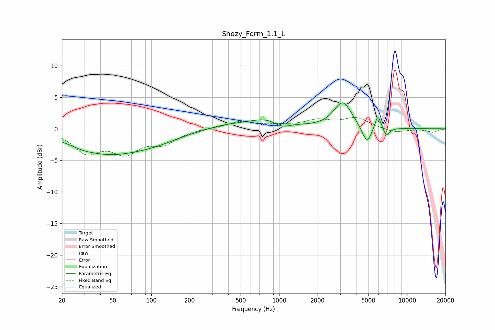

# Shozy_Form_1.1_L
See [usage instructions](https://github.com/jaakkopasanen/AutoEq#usage) for more options and info.

### Parametric EQs
Apply preamp of -4.2 dB when using parametric equalizer.

|   # | Type    |   Fc (Hz) |    Q |   Gain (dB) |
|-----|---------|-----------|------|-------------|
|   1 | Peaking |        29 | 2.35 |        -0.3 |
|   2 | Peaking |        45 | 0.51 |        -3.7 |
|   3 | Peaking |       109 | 0.78 |        -1.1 |
|   4 | Peaking |       376 | 1.05 |         0.6 |
|   5 | Peaking |       824 | 0.94 |         1.7 |
|   6 | Peaking |      1041 | 2.16 |        -1.1 |
|   7 | Peaking |      3146 | 2.01 |         4.2 |
|   8 | Peaking |      4849 | 3.64 |        -2.9 |
|   9 | Peaking |      5920 | 5.98 |         2.4 |
|  10 | Peaking |      6914 | 5.94 |        -1.4 |

### Fixed Band EQs
When using fixed band (also called graphic) equalizer, apply preamp of **-1.9 dB** (if available) and set gains manually with these parameters.

|   # | Type    |   Fc (Hz) |    Q |   Gain (dB) |
|-----|---------|-----------|------|-------------|
|   1 | Peaking |        31 | 1.41 |        -3.5 |
|   2 | Peaking |        62 | 1.41 |        -3.3 |
|   3 | Peaking |       125 | 1.41 |        -2.1 |
|   4 | Peaking |       250 | 1.41 |         0.1 |
|   5 | Peaking |       500 | 1.41 |         1.1 |
|   6 | Peaking |      1000 | 1.41 |         0.4 |
|   7 | Peaking |      2000 | 1.41 |         1.2 |
|   8 | Peaking |      4000 | 1.41 |         1.6 |
|   9 | Peaking |      8000 | 1.41 |        -0.6 |
|  10 | Peaking |     16000 | 1.41 |        -0.5 |

### Graphs

