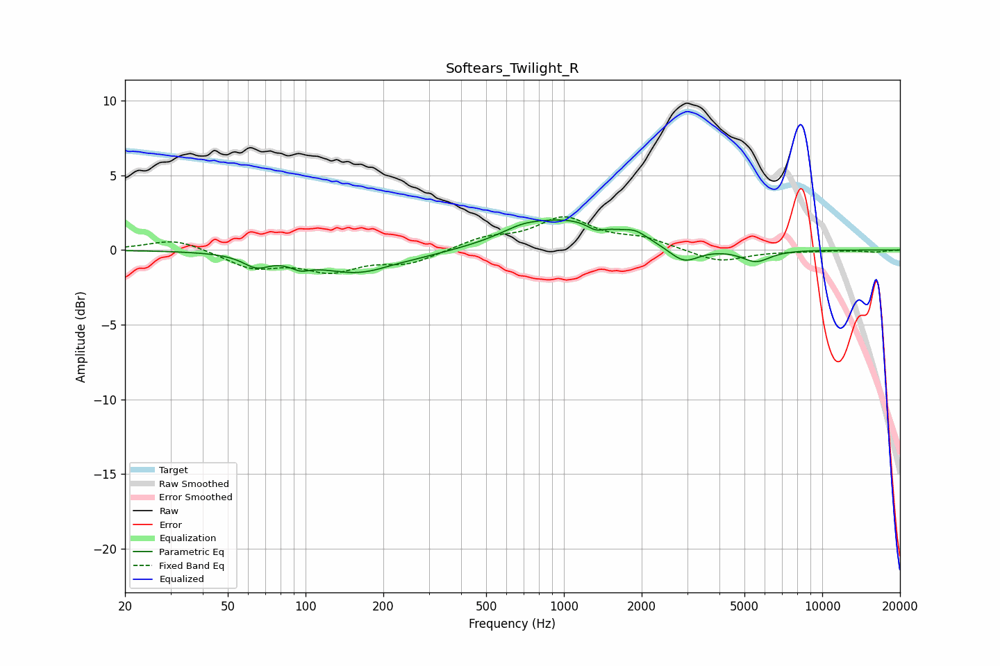

# Softears_Twilight_R
See [usage instructions](https://github.com/jaakkopasanen/AutoEq#usage) for more options and info.

### Parametric EQs
Apply preamp of -2.1 dB when using parametric equalizer.

|   # | Type    |   Fc (Hz) |    Q |   Gain (dB) |
|-----|---------|-----------|------|-------------|
|   1 | Peaking |        64 | 2.81 |        -0.8 |
|   2 | Peaking |        95 | 3.77 |        -0.5 |
|   3 | Peaking |       167 | 0.82 |        -1.7 |
|   4 | Peaking |       213 | 1.6  |         0.2 |
|   5 | Peaking |       689 | 1.66 |         0.5 |
|   6 | Peaking |      1065 | 0.74 |         1.9 |
|   7 | Peaking |      1324 | 4.21 |        -0.4 |
|   8 | Peaking |      1899 | 3.18 |         0.5 |
|   9 | Peaking |      2911 | 2.41 |        -1.1 |
|  10 | Peaking |      5539 | 2.48 |        -0.8 |

### Fixed Band EQs
When using fixed band (also called graphic) equalizer, apply preamp of **-2.3 dB** (if available) and set gains manually with these parameters.

|   # | Type    |   Fc (Hz) |    Q |   Gain (dB) |
|-----|---------|-----------|------|-------------|
|   1 | Peaking |        31 | 1.41 |         0.8 |
|   2 | Peaking |        62 | 1.41 |        -1.1 |
|   3 | Peaking |       125 | 1.41 |        -1.3 |
|   4 | Peaking |       250 | 1.41 |        -0.9 |
|   5 | Peaking |       500 | 1.41 |         0.7 |
|   6 | Peaking |      1000 | 1.41 |         2   |
|   7 | Peaking |      2000 | 1.41 |         0.7 |
|   8 | Peaking |      4000 | 1.41 |        -0.8 |
|   9 | Peaking |      8000 | 1.41 |        -0.1 |
|  10 | Peaking |     16000 | 1.41 |        -0.1 |

### Graphs

