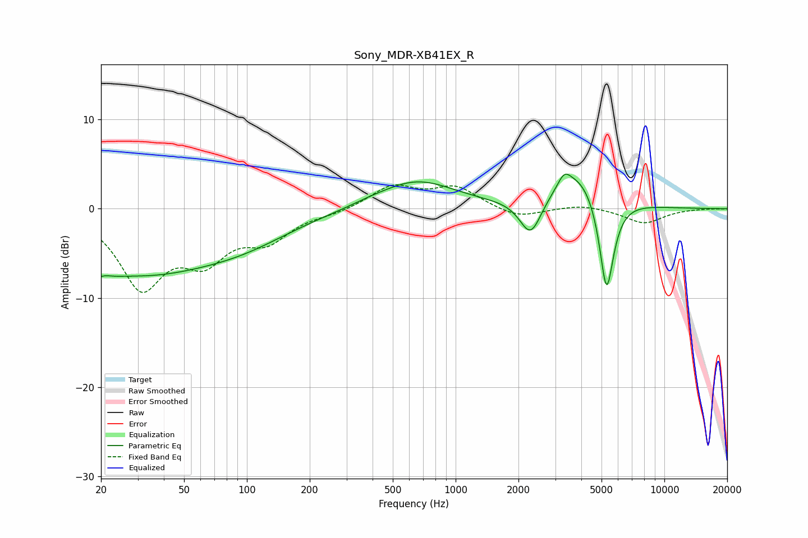

# Sony_MDR-XB41EX_R
See [usage instructions](https://github.com/jaakkopasanen/AutoEq#usage) for more options and info.

### Parametric EQs
Apply preamp of -4.0 dB when using parametric equalizer.

|   # | Type    |   Fc (Hz) |    Q |   Gain (dB) |
|-----|---------|-----------|------|-------------|
|   1 | Peaking |        20 | 2.71 |        -6.5 |
|   2 | Peaking |        20 | 3.08 |         5.1 |
|   3 | Peaking |        31 | 0.39 |        -6.6 |
|   4 | Peaking |        98 | 0.58 |        -2.2 |
|   5 | Peaking |       387 | 1.59 |         0.2 |
|   6 | Peaking |       649 | 0.77 |         3.2 |
|   7 | Peaking |      2288 | 2.7  |        -4.3 |
|   8 | Peaking |      3315 | 4.64 |         1.4 |
|   9 | Peaking |      3953 | 1.11 |         4.6 |
|  10 | Peaking |      5284 | 3.82 |       -11.6 |

### Fixed Band EQs
When using fixed band (also called graphic) equalizer, apply preamp of **-2.8 dB** (if available) and set gains manually with these parameters.

|   # | Type    |   Fc (Hz) |    Q |   Gain (dB) |
|-----|---------|-----------|------|-------------|
|   1 | Peaking |        31 | 1.41 |        -8.4 |
|   2 | Peaking |        62 | 1.41 |        -4.8 |
|   3 | Peaking |       125 | 1.41 |        -3.1 |
|   4 | Peaking |       250 | 1.41 |        -0.4 |
|   5 | Peaking |       500 | 1.41 |         2.5 |
|   6 | Peaking |      1000 | 1.41 |         2.3 |
|   7 | Peaking |      2000 | 1.41 |        -1.1 |
|   8 | Peaking |      4000 | 1.41 |         0.5 |
|   9 | Peaking |      8000 | 1.41 |        -1.6 |
|  10 | Peaking |     16000 | 1.41 |         0   |

### Graphs

