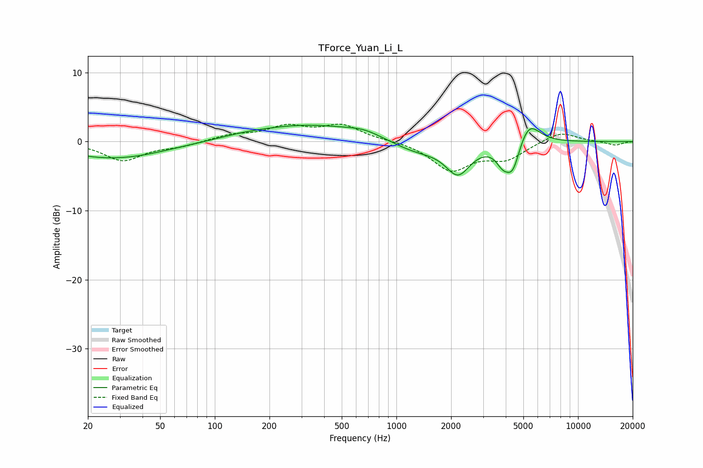

# TForce_Yuan_Li_L
See [usage instructions](https://github.com/jaakkopasanen/AutoEq#usage) for more options and info.

### Parametric EQs
Apply preamp of -2.5 dB when using parametric equalizer.

|   # | Type    |   Fc (Hz) |    Q |   Gain (dB) |
|-----|---------|-----------|------|-------------|
|   1 | Peaking |        20 | 1.09 |        -0.2 |
|   2 | Peaking |        30 | 0.54 |        -2.3 |
|   3 | Peaking |       143 | 1.48 |         0.2 |
|   4 | Peaking |       318 | 0.44 |         2.4 |
|   5 | Peaking |       663 | 1.52 |         0.7 |
|   6 | Peaking |      1279 | 0.99 |        -1.6 |
|   7 | Peaking |      2183 | 2.08 |        -4.3 |
|   8 | Peaking |      3840 | 3.81 |        -2.1 |
|   9 | Peaking |      4371 | 3.46 |        -4.3 |
|  10 | Peaking |      5336 | 2.33 |         3.5 |

### Fixed Band EQs
When using fixed band (also called graphic) equalizer, apply preamp of **-2.6 dB** (if available) and set gains manually with these parameters.

|   # | Type    |   Fc (Hz) |    Q |   Gain (dB) |
|-----|---------|-----------|------|-------------|
|   1 | Peaking |        31 | 1.41 |        -2.7 |
|   2 | Peaking |        62 | 1.41 |        -0.6 |
|   3 | Peaking |       125 | 1.41 |         0.9 |
|   4 | Peaking |       250 | 1.41 |         2   |
|   5 | Peaking |       500 | 1.41 |         2.3 |
|   6 | Peaking |      1000 | 1.41 |         0.1 |
|   7 | Peaking |      2000 | 1.41 |        -4   |
|   8 | Peaking |      4000 | 1.41 |        -2.3 |
|   9 | Peaking |      8000 | 1.41 |         1.5 |
|  10 | Peaking |     16000 | 1.41 |        -0.5 |

### Graphs

