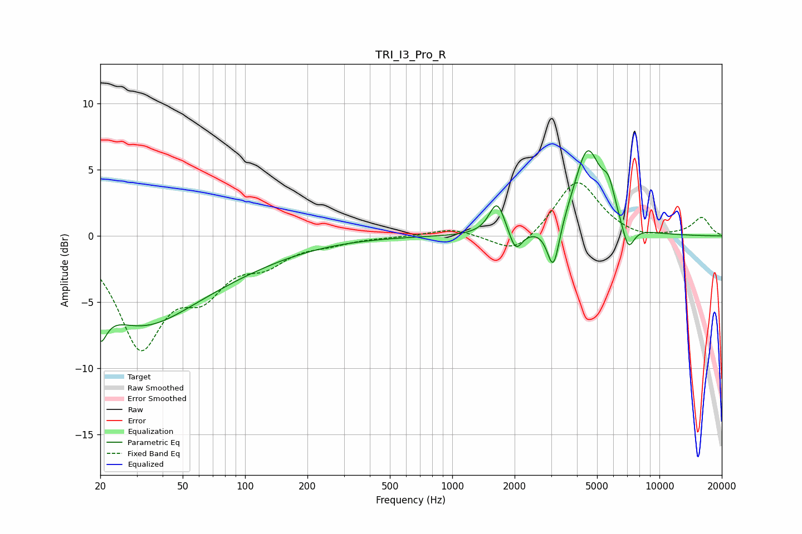

# TRI_I3_Pro_R
See [usage instructions](https://github.com/jaakkopasanen/AutoEq#usage) for more options and info.

### Parametric EQs
Apply preamp of -6.5 dB when using parametric equalizer.

|   # | Type    |   Fc (Hz) |    Q |   Gain (dB) |
|-----|---------|-----------|------|-------------|
|   1 | Peaking |        20 | 5.29 |        -7.1 |
|   2 | Peaking |        20 | 5.88 |         4.2 |
|   3 | Peaking |        30 | 0.55 |        -5.8 |
|   4 | Peaking |        78 | 0.45 |        -1.6 |
|   5 | Peaking |      1647 | 3.75 |         2.5 |
|   6 | Peaking |      2023 | 4.5  |        -1.7 |
|   7 | Peaking |      3078 | 4.77 |        -3.6 |
|   8 | Peaking |      4494 | 2.15 |         6.4 |
|   9 | Peaking |      5693 | 4.34 |         2.1 |
|  10 | Peaking |      7072 | 4.58 |        -2   |

### Fixed Band EQs
When using fixed band (also called graphic) equalizer, apply preamp of **-4.1 dB** (if available) and set gains manually with these parameters.

|   # | Type    |   Fc (Hz) |    Q |   Gain (dB) |
|-----|---------|-----------|------|-------------|
|   1 | Peaking |        31 | 1.41 |        -8   |
|   2 | Peaking |        62 | 1.41 |        -3.4 |
|   3 | Peaking |       125 | 1.41 |        -1.7 |
|   4 | Peaking |       250 | 1.41 |        -0.4 |
|   5 | Peaking |       500 | 1.41 |        -0   |
|   6 | Peaking |      1000 | 1.41 |         0.6 |
|   7 | Peaking |      2000 | 1.41 |        -1.5 |
|   8 | Peaking |      4000 | 1.41 |         4.3 |
|   9 | Peaking |      8000 | 1.41 |        -0.3 |
|  10 | Peaking |     16000 | 1.41 |         1.4 |

### Graphs

