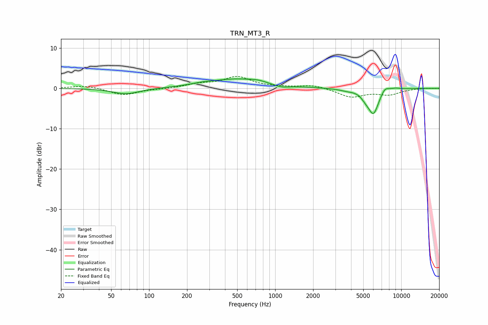

# TRN_MT3_R
See [usage instructions](https://github.com/jaakkopasanen/AutoEq#usage) for more options and info.

### Parametric EQs
Apply preamp of -2.4 dB when using parametric equalizer.

|   # | Type    |   Fc (Hz) |    Q |   Gain (dB) |
|-----|---------|-----------|------|-------------|
|   1 | Peaking |        66 | 1.36 |        -1.4 |
|   2 | Peaking |       260 | 1.81 |         0.3 |
|   3 | Peaking |       501 | 0.61 |         2.3 |
|   4 | Peaking |       733 | 2.47 |         0.3 |
|   5 | Peaking |      1115 | 2.33 |        -0.7 |
|   6 | Peaking |      3683 | 2.56 |        -0.4 |
|   7 | Peaking |      5208 | 3.93 |        -1.1 |
|   8 | Peaking |      6018 | 3.23 |        -6   |
|   9 | Peaking |      7425 | 4.38 |         1.3 |
|  10 | Peaking |      8921 | 3.09 |         0.4 |

### Fixed Band EQs
When using fixed band (also called graphic) equalizer, apply preamp of **-3.0 dB** (if available) and set gains manually with these parameters.

|   # | Type    |   Fc (Hz) |    Q |   Gain (dB) |
|-----|---------|-----------|------|-------------|
|   1 | Peaking |        31 | 1.41 |         0.7 |
|   2 | Peaking |        62 | 1.41 |        -1.7 |
|   3 | Peaking |       125 | 1.41 |        -0.1 |
|   4 | Peaking |       250 | 1.41 |         1   |
|   5 | Peaking |       500 | 1.41 |         2.7 |
|   6 | Peaking |      1000 | 1.41 |         0.2 |
|   7 | Peaking |      2000 | 1.41 |         0.8 |
|   8 | Peaking |      4000 | 1.41 |        -2.1 |
|   9 | Peaking |      8000 | 1.41 |        -1.4 |
|  10 | Peaking |     16000 | 1.41 |         0.1 |

### Graphs

