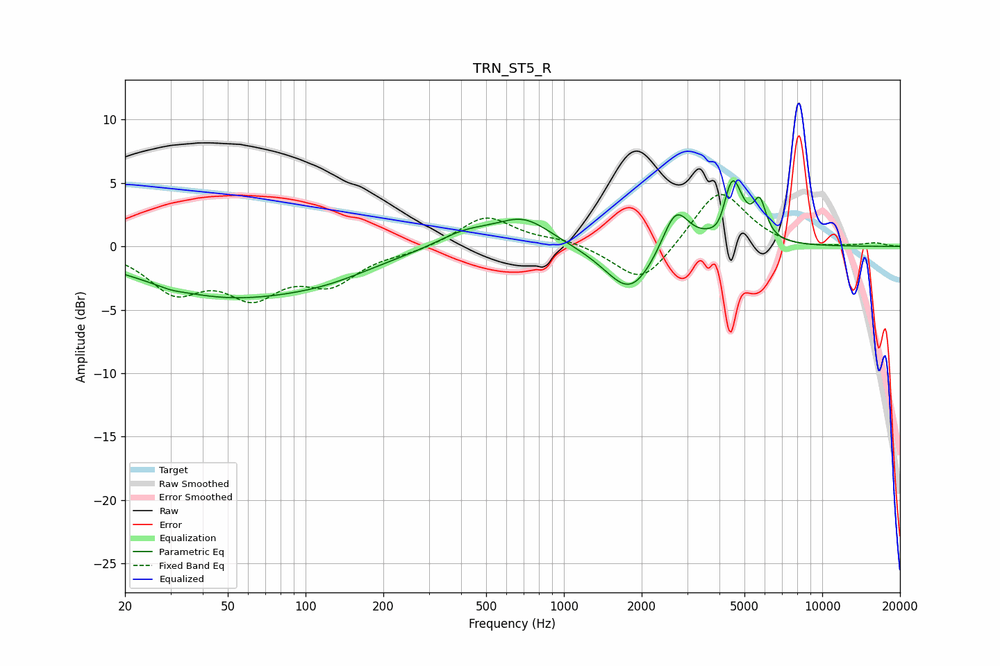

# TRN_ST5_R
See [usage instructions](https://github.com/jaakkopasanen/AutoEq#usage) for more options and info.

### Parametric EQs
Apply preamp of -5.3 dB when using parametric equalizer.

|   # | Type    |   Fc (Hz) |    Q |   Gain (dB) |
|-----|---------|-----------|------|-------------|
|   1 | Peaking |        30 | 3.13 |        -0.2 |
|   2 | Peaking |        49 | 0.42 |        -3.7 |
|   3 | Peaking |       124 | 0.72 |        -1   |
|   4 | Peaking |       413 | 1.27 |         1.1 |
|   5 | Peaking |       700 | 1.29 |         2.2 |
|   6 | Peaking |      1807 | 1.48 |        -3.9 |
|   7 | Peaking |      2707 | 2.7  |         3.5 |
|   8 | Peaking |      4050 | 4.17 |        -1.5 |
|   9 | Peaking |      4470 | 3.42 |         5.7 |
|  10 | Peaking |      5733 | 5.62 |         2.7 |

### Fixed Band EQs
When using fixed band (also called graphic) equalizer, apply preamp of **-4.2 dB** (if available) and set gains manually with these parameters.

|   # | Type    |   Fc (Hz) |    Q |   Gain (dB) |
|-----|---------|-----------|------|-------------|
|   1 | Peaking |        31 | 1.41 |        -3.2 |
|   2 | Peaking |        62 | 1.41 |        -3.4 |
|   3 | Peaking |       125 | 1.41 |        -2.6 |
|   4 | Peaking |       250 | 1.41 |        -0.4 |
|   5 | Peaking |       500 | 1.41 |         2.4 |
|   6 | Peaking |      1000 | 1.41 |         0.5 |
|   7 | Peaking |      2000 | 1.41 |        -3.2 |
|   8 | Peaking |      4000 | 1.41 |         4.6 |
|   9 | Peaking |      8000 | 1.41 |        -0.3 |
|  10 | Peaking |     16000 | 1.41 |         0.3 |

### Graphs

