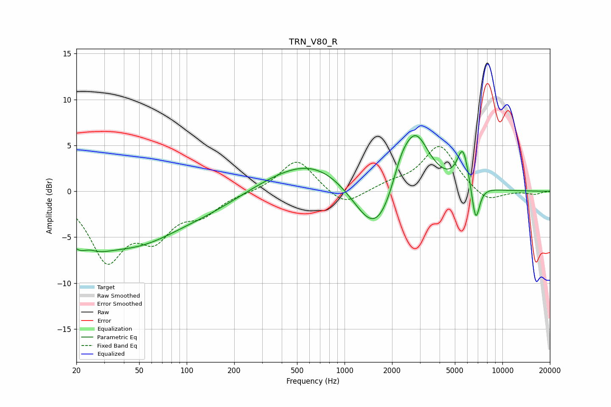

# TRN_V80_R
See [usage instructions](https://github.com/jaakkopasanen/AutoEq#usage) for more options and info.

### Parametric EQs
Apply preamp of -6.2 dB when using parametric equalizer.

|   # | Type    |   Fc (Hz) |    Q |   Gain (dB) |
|-----|---------|-----------|------|-------------|
|   1 | Peaking |        22 | 1.36 |        -5.6 |
|   2 | Peaking |        24 | 2.26 |         2.5 |
|   3 | Peaking |        47 | 0.48 |        -5.1 |
|   4 | Peaking |       147 | 0.65 |        -1   |
|   5 | Peaking |       654 | 0.5  |         3.8 |
|   6 | Peaking |      1580 | 0.99 |        -6.9 |
|   7 | Peaking |      2266 | 2.52 |         2.2 |
|   8 | Peaking |      2801 | 1.49 |         7.1 |
|   9 | Peaking |      5624 | 3.75 |         4.2 |
|  10 | Peaking |      6771 | 5.39 |        -4.3 |

### Fixed Band EQs
When using fixed band (also called graphic) equalizer, apply preamp of **-5.0 dB** (if available) and set gains manually with these parameters.

|   # | Type    |   Fc (Hz) |    Q |   Gain (dB) |
|-----|---------|-----------|------|-------------|
|   1 | Peaking |        31 | 1.41 |        -7.1 |
|   2 | Peaking |        62 | 1.41 |        -4.2 |
|   3 | Peaking |       125 | 1.41 |        -2.1 |
|   4 | Peaking |       250 | 1.41 |        -0.1 |
|   5 | Peaking |       500 | 1.41 |         3.6 |
|   6 | Peaking |      1000 | 1.41 |        -1.8 |
|   7 | Peaking |      2000 | 1.41 |         0.7 |
|   8 | Peaking |      4000 | 1.41 |         5   |
|   9 | Peaking |      8000 | 1.41 |        -1.4 |
|  10 | Peaking |     16000 | 1.41 |        -0.3 |

### Graphs

