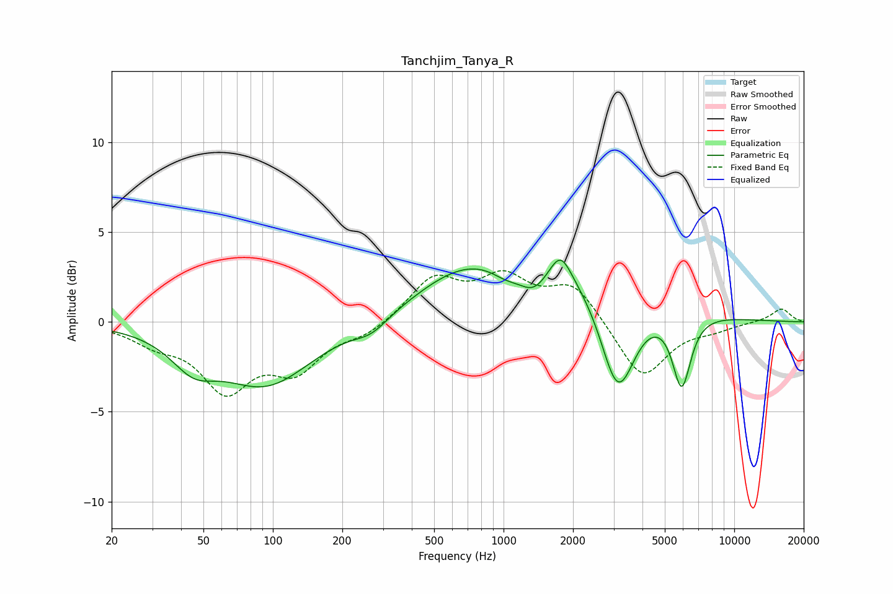

# Tanchjim_Tanya_R
See [usage instructions](https://github.com/jaakkopasanen/AutoEq#usage) for more options and info.

### Parametric EQs
Apply preamp of -3.5 dB when using parametric equalizer.

|   # | Type    |   Fc (Hz) |    Q |   Gain (dB) |
|-----|---------|-----------|------|-------------|
|   1 | Peaking |        45 | 1.47 |        -1.6 |
|   2 | Peaking |        93 | 0.71 |        -3.4 |
|   3 | Peaking |       267 | 1.87 |        -0.7 |
|   4 | Peaking |       642 | 0.69 |         1.8 |
|   5 | Peaking |      1030 | 2.03 |        -0.7 |
|   6 | Peaking |      1351 | 2.22 |        -1.4 |
|   7 | Peaking |      1766 | 3.16 |         1.5 |
|   8 | Peaking |      1864 | 0.41 |         3.3 |
|   9 | Peaking |      3128 | 1.8  |        -6.1 |
|  10 | Peaking |      5914 | 3.44 |        -4.1 |

### Fixed Band EQs
When using fixed band (also called graphic) equalizer, apply preamp of **-3.0 dB** (if available) and set gains manually with these parameters.

|   # | Type    |   Fc (Hz) |    Q |   Gain (dB) |
|-----|---------|-----------|------|-------------|
|   1 | Peaking |        31 | 1.41 |        -0.9 |
|   2 | Peaking |        62 | 1.41 |        -3.5 |
|   3 | Peaking |       125 | 1.41 |        -2.4 |
|   4 | Peaking |       250 | 1.41 |        -0.7 |
|   5 | Peaking |       500 | 1.41 |         2.3 |
|   6 | Peaking |      1000 | 1.41 |         2.2 |
|   7 | Peaking |      2000 | 1.41 |         2   |
|   8 | Peaking |      4000 | 1.41 |        -3.2 |
|   9 | Peaking |      8000 | 1.41 |        -0.3 |
|  10 | Peaking |     16000 | 1.41 |         0.8 |

### Graphs

