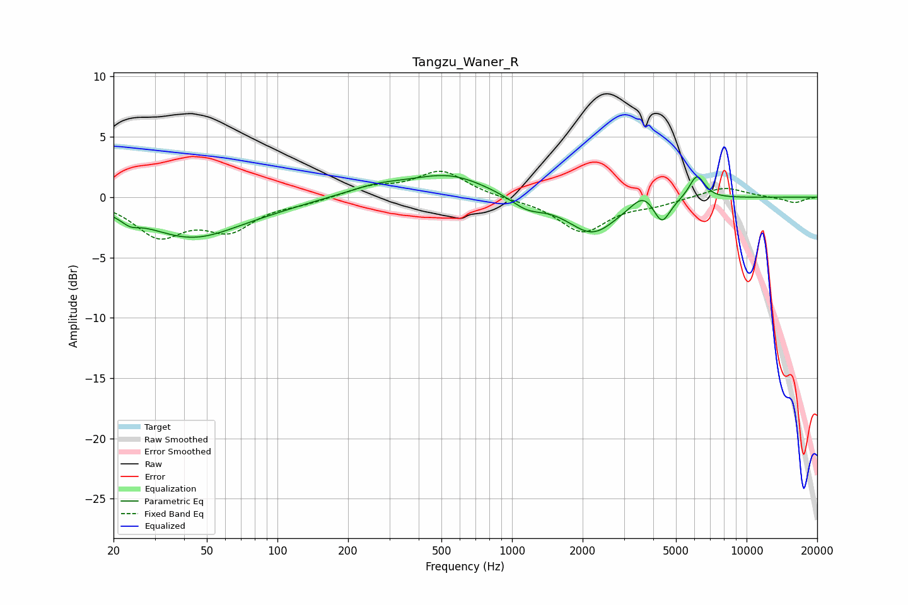

# Tangzu_Waner_R
See [usage instructions](https://github.com/jaakkopasanen/AutoEq#usage) for more options and info.

### Parametric EQs
Apply preamp of -1.9 dB when using parametric equalizer.

|   # | Type    |   Fc (Hz) |    Q |   Gain (dB) |
|-----|---------|-----------|------|-------------|
|   1 | Peaking |        24 | 3.83 |        -0.6 |
|   2 | Peaking |        43 | 0.67 |        -3.3 |
|   3 | Peaking |        95 | 0.96 |        -0.2 |
|   4 | Peaking |       265 | 1.09 |         0.7 |
|   5 | Peaking |       541 | 0.86 |         1.8 |
|   6 | Peaking |      1158 | 1.98 |        -1   |
|   7 | Peaking |      2201 | 1.32 |        -3   |
|   8 | Peaking |      3627 | 2.8  |         1.2 |
|   9 | Peaking |      4354 | 4.01 |        -2   |
|  10 | Peaking |      6142 | 4.14 |         2   |

### Fixed Band EQs
When using fixed band (also called graphic) equalizer, apply preamp of **-2.2 dB** (if available) and set gains manually with these parameters.

|   # | Type    |   Fc (Hz) |    Q |   Gain (dB) |
|-----|---------|-----------|------|-------------|
|   1 | Peaking |        31 | 1.41 |        -3   |
|   2 | Peaking |        62 | 1.41 |        -2.5 |
|   3 | Peaking |       125 | 1.41 |        -0.4 |
|   4 | Peaking |       250 | 1.41 |         0.8 |
|   5 | Peaking |       500 | 1.41 |         2.2 |
|   6 | Peaking |      1000 | 1.41 |        -0.1 |
|   7 | Peaking |      2000 | 1.41 |        -2.9 |
|   8 | Peaking |      4000 | 1.41 |        -0.5 |
|   9 | Peaking |      8000 | 1.41 |         0.9 |
|  10 | Peaking |     16000 | 1.41 |        -0.5 |

### Graphs

