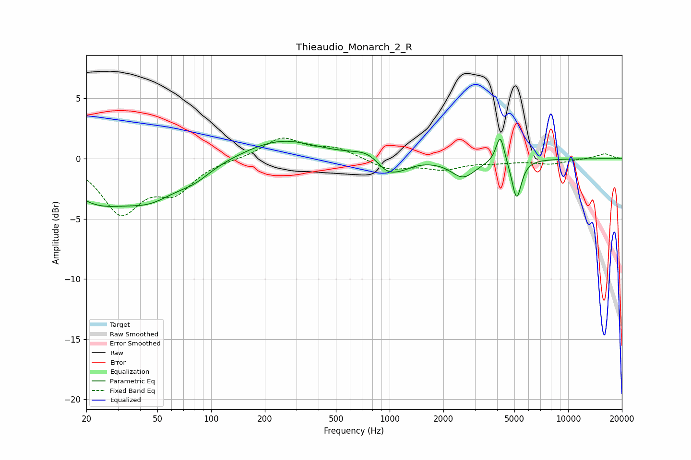

# Thieaudio_Monarch_2_R
See [usage instructions](https://github.com/jaakkopasanen/AutoEq#usage) for more options and info.

### Parametric EQs
Apply preamp of -1.7 dB when using parametric equalizer.

|   # | Type    |   Fc (Hz) |    Q |   Gain (dB) |
|-----|---------|-----------|------|-------------|
|   1 | Peaking |        23 | 0.79 |        -3   |
|   2 | Peaking |        46 | 0.91 |        -2.4 |
|   3 | Peaking |        81 | 1.42 |        -1   |
|   4 | Peaking |       246 | 0.7  |         1.6 |
|   5 | Peaking |       765 | 1.69 |         0.7 |
|   6 | Peaking |       964 | 2.2  |        -1.2 |
|   7 | Peaking |      1172 | 2.04 |        -0.6 |
|   8 | Peaking |      2579 | 2.07 |        -1.5 |
|   9 | Peaking |      4163 | 6    |         2.4 |
|  10 | Peaking |      5144 | 5.32 |        -3.3 |

### Fixed Band EQs
When using fixed band (also called graphic) equalizer, apply preamp of **-1.8 dB** (if available) and set gains manually with these parameters.

|   # | Type    |   Fc (Hz) |    Q |   Gain (dB) |
|-----|---------|-----------|------|-------------|
|   1 | Peaking |        31 | 1.41 |        -4.3 |
|   2 | Peaking |        62 | 1.41 |        -2.4 |
|   3 | Peaking |       125 | 1.41 |        -0   |
|   4 | Peaking |       250 | 1.41 |         1.7 |
|   5 | Peaking |       500 | 1.41 |         0.8 |
|   6 | Peaking |      1000 | 1.41 |        -0.9 |
|   7 | Peaking |      2000 | 1.41 |        -0.8 |
|   8 | Peaking |      4000 | 1.41 |        -0.2 |
|   9 | Peaking |      8000 | 1.41 |        -0.4 |
|  10 | Peaking |     16000 | 1.41 |         0.4 |

### Graphs

