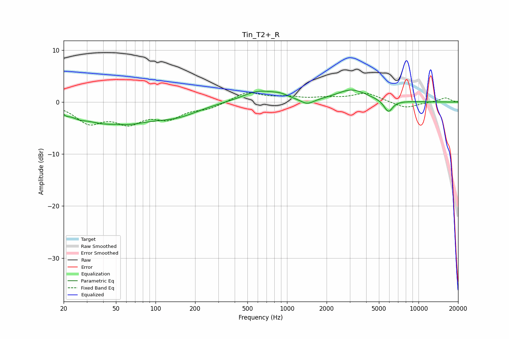

# Tin_T2+_R
See [usage instructions](https://github.com/jaakkopasanen/AutoEq#usage) for more options and info.

### Parametric EQs
Apply preamp of -2.4 dB when using parametric equalizer.

|   # | Type    |   Fc (Hz) |    Q |   Gain (dB) |
|-----|---------|-----------|------|-------------|
|   1 | Peaking |        21 | 5.93 |        -0.4 |
|   2 | Peaking |        26 | 3.08 |        -0.6 |
|   3 | Peaking |        49 | 0.56 |        -4.4 |
|   4 | Peaking |        50 | 2.27 |         0.4 |
|   5 | Peaking |       147 | 0.86 |        -1.9 |
|   6 | Peaking |       618 | 1.06 |         2.2 |
|   7 | Peaking |       894 | 2.57 |         0.5 |
|   8 | Peaking |      1425 | 2.81 |        -1.1 |
|   9 | Peaking |      3114 | 1.22 |         2.3 |
|  10 | Peaking |      5897 | 4.12 |        -2.3 |

### Fixed Band EQs
When using fixed band (also called graphic) equalizer, apply preamp of **-1.9 dB** (if available) and set gains manually with these parameters.

|   # | Type    |   Fc (Hz) |    Q |   Gain (dB) |
|-----|---------|-----------|------|-------------|
|   1 | Peaking |        31 | 1.41 |        -3.7 |
|   2 | Peaking |        62 | 1.41 |        -3.4 |
|   3 | Peaking |       125 | 1.41 |        -2.7 |
|   4 | Peaking |       250 | 1.41 |        -1.1 |
|   5 | Peaking |       500 | 1.41 |         1.9 |
|   6 | Peaking |      1000 | 1.41 |         0.8 |
|   7 | Peaking |      2000 | 1.41 |         0.6 |
|   8 | Peaking |      4000 | 1.41 |         1.7 |
|   9 | Peaking |      8000 | 1.41 |        -1.2 |
|  10 | Peaking |     16000 | 1.41 |         0.8 |

### Graphs

