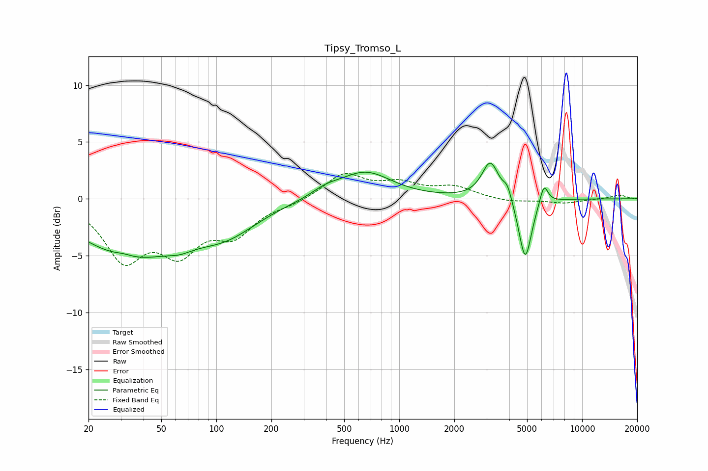

# Tipsy_Tromso_L
See [usage instructions](https://github.com/jaakkopasanen/AutoEq#usage) for more options and info.

### Parametric EQs
Apply preamp of -3.2 dB when using parametric equalizer.

|   # | Type    |   Fc (Hz) |    Q |   Gain (dB) |
|-----|---------|-----------|------|-------------|
|   1 | Peaking |        31 | 2.84 |         0.3 |
|   2 | Peaking |        34 | 0.5  |        -4.8 |
|   3 | Peaking |        63 | 2.11 |        -0.5 |
|   4 | Peaking |       113 | 0.8  |        -2.3 |
|   5 | Peaking |       394 | 1.86 |         0.6 |
|   6 | Peaking |       650 | 0.98 |         2.4 |
|   7 | Peaking |      3150 | 3.06 |         3.3 |
|   8 | Peaking |      3905 | 5.94 |         1.1 |
|   9 | Peaking |      4883 | 3.95 |        -5.6 |
|  10 | Peaking |      6176 | 6    |         1.8 |

### Fixed Band EQs
When using fixed band (also called graphic) equalizer, apply preamp of **-2.3 dB** (if available) and set gains manually with these parameters.

|   # | Type    |   Fc (Hz) |    Q |   Gain (dB) |
|-----|---------|-----------|------|-------------|
|   1 | Peaking |        31 | 1.41 |        -5   |
|   2 | Peaking |        62 | 1.41 |        -4.1 |
|   3 | Peaking |       125 | 1.41 |        -2.8 |
|   4 | Peaking |       250 | 1.41 |        -0.4 |
|   5 | Peaking |       500 | 1.41 |         2.2 |
|   6 | Peaking |      1000 | 1.41 |         1.2 |
|   7 | Peaking |      2000 | 1.41 |         1   |
|   8 | Peaking |      4000 | 1.41 |        -0.3 |
|   9 | Peaking |      8000 | 1.41 |        -0.4 |
|  10 | Peaking |     16000 | 1.41 |         0.3 |

### Graphs

