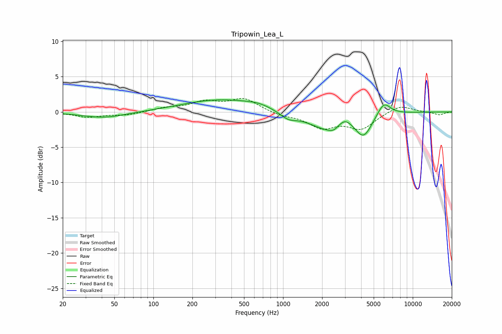

# Tripowin_Lea_L
See [usage instructions](https://github.com/jaakkopasanen/AutoEq#usage) for more options and info.

### Parametric EQs
Apply preamp of -1.8 dB when using parametric equalizer.

|   # | Type    |   Fc (Hz) |    Q |   Gain (dB) |
|-----|---------|-----------|------|-------------|
|   1 | Peaking |        42 | 0.85 |        -0.8 |
|   2 | Peaking |       188 | 2    |         0   |
|   3 | Peaking |       336 | 0.48 |         1.7 |
|   4 | Peaking |       646 | 1.53 |         0.4 |
|   5 | Peaking |      1097 | 2.24 |        -0.9 |
|   6 | Peaking |      2206 | 0.95 |        -2.5 |
|   7 | Peaking |      2453 | 3.6  |        -0.6 |
|   8 | Peaking |      2981 | 2.49 |         1.3 |
|   9 | Peaking |      4176 | 2.19 |        -3   |
|  10 | Peaking |      5980 | 2.7  |         2   |

### Fixed Band EQs
When using fixed band (also called graphic) equalizer, apply preamp of **-2.0 dB** (if available) and set gains manually with these parameters.

|   # | Type    |   Fc (Hz) |    Q |   Gain (dB) |
|-----|---------|-----------|------|-------------|
|   1 | Peaking |        31 | 1.41 |        -0.7 |
|   2 | Peaking |        62 | 1.41 |        -0.4 |
|   3 | Peaking |       125 | 1.41 |         0.5 |
|   4 | Peaking |       250 | 1.41 |         1.3 |
|   5 | Peaking |       500 | 1.41 |         1.8 |
|   6 | Peaking |      1000 | 1.41 |        -0.5 |
|   7 | Peaking |      2000 | 1.41 |        -2.1 |
|   8 | Peaking |      4000 | 1.41 |        -2.3 |
|   9 | Peaking |      8000 | 1.41 |         1   |
|  10 | Peaking |     16000 | 1.41 |        -0.4 |

### Graphs

