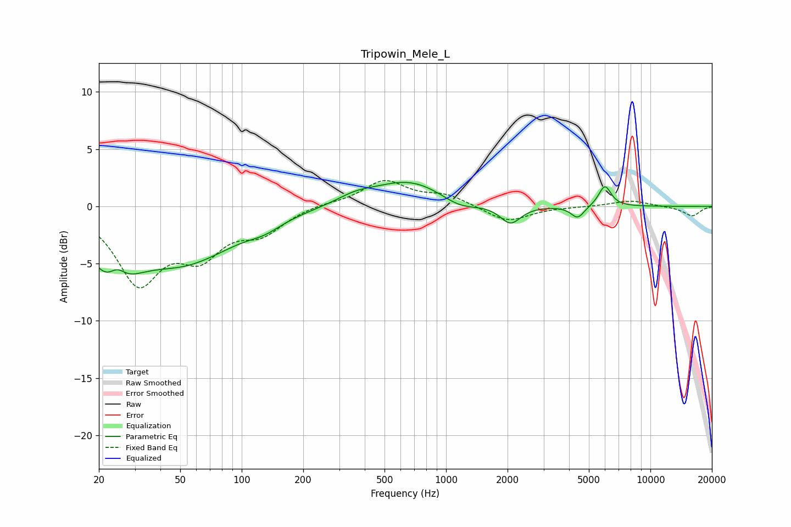

# Tripowin_Mele_L
See [usage instructions](https://github.com/jaakkopasanen/AutoEq#usage) for more options and info.

### Parametric EQs
Apply preamp of -2.2 dB when using parametric equalizer.

|   # | Type    |   Fc (Hz) |    Q |   Gain (dB) |
|-----|---------|-----------|------|-------------|
|   1 | Peaking |        23 | 1.37 |        -5.2 |
|   2 | Peaking |        25 | 3.13 |         2   |
|   3 | Peaking |        52 | 0.56 |        -4.5 |
|   4 | Peaking |       130 | 1.75 |        -0.7 |
|   5 | Peaking |       360 | 1.57 |         0.6 |
|   6 | Peaking |       662 | 0.78 |         2.3 |
|   7 | Peaking |      1163 | 1.53 |        -0.9 |
|   8 | Peaking |      2068 | 2.79 |        -1.6 |
|   9 | Peaking |      4406 | 4.32 |        -1.1 |
|  10 | Peaking |      5987 | 4.54 |         1.8 |

### Fixed Band EQs
When using fixed band (also called graphic) equalizer, apply preamp of **-2.4 dB** (if available) and set gains manually with these parameters.

|   # | Type    |   Fc (Hz) |    Q |   Gain (dB) |
|-----|---------|-----------|------|-------------|
|   1 | Peaking |        31 | 1.41 |        -6.4 |
|   2 | Peaking |        62 | 1.41 |        -3.6 |
|   3 | Peaking |       125 | 1.41 |        -2   |
|   4 | Peaking |       250 | 1.41 |         0.3 |
|   5 | Peaking |       500 | 1.41 |         2.2 |
|   6 | Peaking |      1000 | 1.41 |         0.9 |
|   7 | Peaking |      2000 | 1.41 |        -1.4 |
|   8 | Peaking |      4000 | 1.41 |        -0   |
|   9 | Peaking |      8000 | 1.41 |         0.5 |
|  10 | Peaking |     16000 | 1.41 |        -0.8 |

### Graphs

