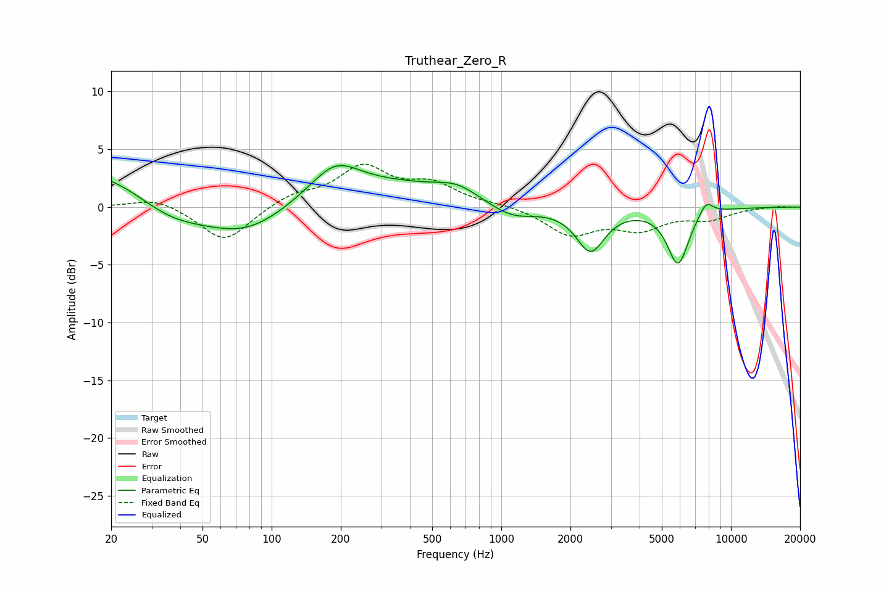

# Truthear_Zero_R
See [usage instructions](https://github.com/jaakkopasanen/AutoEq#usage) for more options and info.

### Parametric EQs
Apply preamp of -3.7 dB when using parametric equalizer.

|   # | Type    |   Fc (Hz) |    Q |   Gain (dB) |
|-----|---------|-----------|------|-------------|
|   1 | Peaking |        36 | 0.83 |        -3   |
|   2 | Peaking |        37 | 0.18 |         5.1 |
|   3 | Peaking |        77 | 0.6  |        -5.8 |
|   4 | Peaking |       189 | 1.36 |         2.5 |
|   5 | Peaking |       405 | 0.58 |         1.2 |
|   6 | Peaking |       642 | 1.57 |         1   |
|   7 | Peaking |      1111 | 1.4  |        -1.2 |
|   8 | Peaking |      2446 | 2.29 |        -3.7 |
|   9 | Peaking |      5881 | 2.94 |        -4.8 |
|  10 | Peaking |      7784 | 4.28 |         1.2 |

### Fixed Band EQs
When using fixed band (also called graphic) equalizer, apply preamp of **-3.8 dB** (if available) and set gains manually with these parameters.

|   # | Type    |   Fc (Hz) |    Q |   Gain (dB) |
|-----|---------|-----------|------|-------------|
|   1 | Peaking |        31 | 1.41 |         0.9 |
|   2 | Peaking |        62 | 1.41 |        -3.1 |
|   3 | Peaking |       125 | 1.41 |         1   |
|   4 | Peaking |       250 | 1.41 |         3.3 |
|   5 | Peaking |       500 | 1.41 |         1.8 |
|   6 | Peaking |      1000 | 1.41 |         0.2 |
|   7 | Peaking |      2000 | 1.41 |        -2.3 |
|   8 | Peaking |      4000 | 1.41 |        -1.7 |
|   9 | Peaking |      8000 | 1.41 |        -0.9 |
|  10 | Peaking |     16000 | 1.41 |         0.1 |

### Graphs

