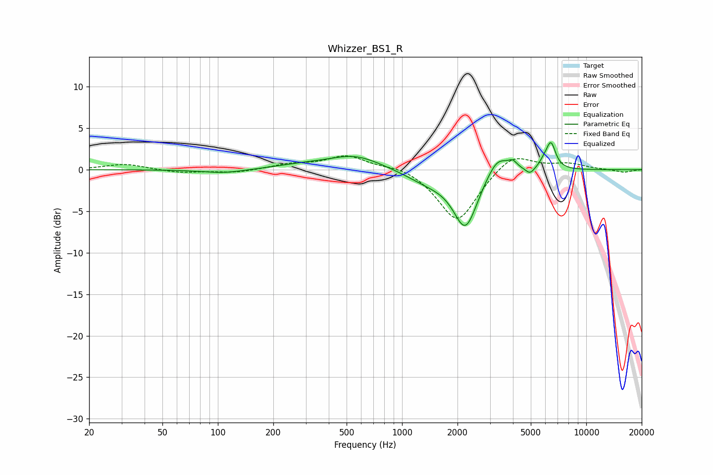

# Whizzer_BS1_R
See [usage instructions](https://github.com/jaakkopasanen/AutoEq#usage) for more options and info.

### Parametric EQs
Apply preamp of -3.4 dB when using parametric equalizer.

|   # | Type    |   Fc (Hz) |    Q |   Gain (dB) |
|-----|---------|-----------|------|-------------|
|   1 | Peaking |       107 | 1.23 |        -0.4 |
|   2 | Peaking |       281 | 0.97 |         0.4 |
|   3 | Peaking |       556 | 0.97 |         1.7 |
|   4 | Peaking |      1394 | 1.12 |        -1.3 |
|   5 | Peaking |      2210 | 2.15 |        -6.7 |
|   6 | Peaking |      3297 | 2.38 |         2.5 |
|   7 | Peaking |      3990 | 5.99 |         0.8 |
|   8 | Peaking |      4950 | 5.99 |        -0.8 |
|   9 | Peaking |      5877 | 6    |         0.6 |
|  10 | Peaking |      6426 | 5.33 |         3.1 |

### Fixed Band EQs
When using fixed band (also called graphic) equalizer, apply preamp of **-1.8 dB** (if available) and set gains manually with these parameters.

|   # | Type    |   Fc (Hz) |    Q |   Gain (dB) |
|-----|---------|-----------|------|-------------|
|   1 | Peaking |        31 | 1.41 |         0.7 |
|   2 | Peaking |        62 | 1.41 |        -0.4 |
|   3 | Peaking |       125 | 1.41 |        -0.4 |
|   4 | Peaking |       250 | 1.41 |         0.6 |
|   5 | Peaking |       500 | 1.41 |         1.7 |
|   6 | Peaking |      1000 | 1.41 |         0.6 |
|   7 | Peaking |      2000 | 1.41 |        -6.4 |
|   8 | Peaking |      4000 | 1.41 |         2.2 |
|   9 | Peaking |      8000 | 1.41 |         0.7 |
|  10 | Peaking |     16000 | 1.41 |        -0.3 |

### Graphs

