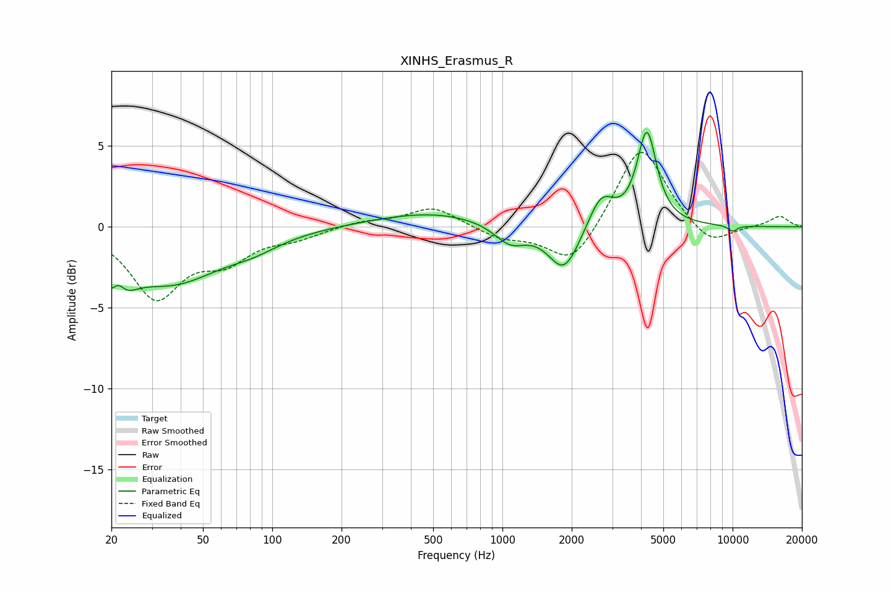

# XINHS_Erasmus_R
See [usage instructions](https://github.com/jaakkopasanen/AutoEq#usage) for more options and info.

### Parametric EQs
Apply preamp of -5.9 dB when using parametric equalizer.

|   # | Type    |   Fc (Hz) |    Q |   Gain (dB) |
|-----|---------|-----------|------|-------------|
|   1 | Peaking |        21 | 2.44 |        -3.6 |
|   2 | Peaking |        21 | 4.52 |         1.9 |
|   3 | Peaking |        37 | 0.68 |        -3.2 |
|   4 | Peaking |        83 | 1.19 |        -0.7 |
|   5 | Peaking |       497 | 0.56 |         0.9 |
|   6 | Peaking |      1081 | 2.03 |        -1.2 |
|   7 | Peaking |      1852 | 2.08 |        -2.9 |
|   8 | Peaking |      2686 | 2.56 |         2   |
|   9 | Peaking |      4242 | 3.37 |         5.7 |
|  10 | Peaking |     10000 | 6    |        -0.4 |

### Fixed Band EQs
When using fixed band (also called graphic) equalizer, apply preamp of **-4.7 dB** (if available) and set gains manually with these parameters.

|   # | Type    |   Fc (Hz) |    Q |   Gain (dB) |
|-----|---------|-----------|------|-------------|
|   1 | Peaking |        31 | 1.41 |        -4.2 |
|   2 | Peaking |        62 | 1.41 |        -1.8 |
|   3 | Peaking |       125 | 1.41 |        -0.6 |
|   4 | Peaking |       250 | 1.41 |         0.3 |
|   5 | Peaking |       500 | 1.41 |         1.2 |
|   6 | Peaking |      1000 | 1.41 |        -0.7 |
|   7 | Peaking |      2000 | 1.41 |        -2.5 |
|   8 | Peaking |      4000 | 1.41 |         5.2 |
|   9 | Peaking |      8000 | 1.41 |        -1.3 |
|  10 | Peaking |     16000 | 1.41 |         0.7 |

### Graphs

