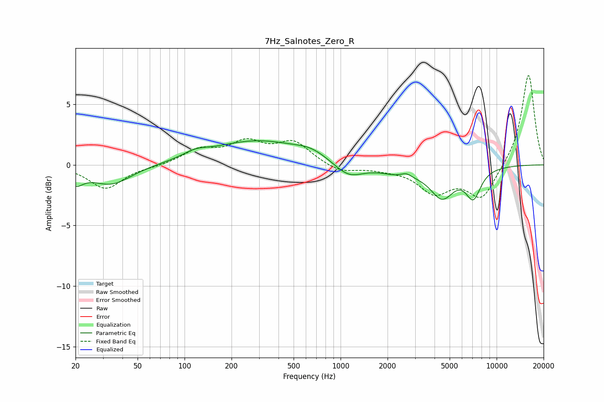

# 7Hz_Salnotes_Zero_R
See [usage instructions](https://github.com/jaakkopasanen/AutoEq#usage) for more options and info.

### Parametric EQs
Apply preamp of -2.1 dB when using parametric equalizer.

|   # | Type    |   Fc (Hz) |    Q |   Gain (dB) |
|-----|---------|-----------|------|-------------|
|   1 | Peaking |        20 | 2.89 |        -1.2 |
|   2 | Peaking |        34 | 1.08 |        -1.6 |
|   3 | Peaking |       117 | 1.85 |         0.5 |
|   4 | Peaking |       291 | 0.48 |         1.9 |
|   5 | Peaking |       649 | 1.41 |         0.6 |
|   6 | Peaking |      1123 | 1.52 |        -1.2 |
|   7 | Peaking |      2459 | 1.12 |        -0.7 |
|   8 | Peaking |      2631 | 3.86 |         0.4 |
|   9 | Peaking |      4474 | 1.86 |        -2.4 |
|  10 | Peaking |      7085 | 2.8  |        -2.3 |

### Fixed Band EQs
When using fixed band (also called graphic) equalizer, apply preamp of **-7.5 dB** (if available) and set gains manually with these parameters.

|   # | Type    |   Fc (Hz) |    Q |   Gain (dB) |
|-----|---------|-----------|------|-------------|
|   1 | Peaking |        31 | 1.41 |        -2   |
|   2 | Peaking |        62 | 1.41 |        -0.1 |
|   3 | Peaking |       125 | 1.41 |         1.2 |
|   4 | Peaking |       250 | 1.41 |         1.7 |
|   5 | Peaking |       500 | 1.41 |         1.8 |
|   6 | Peaking |      1000 | 1.41 |        -0.7 |
|   7 | Peaking |      2000 | 1.41 |        -0.2 |
|   8 | Peaking |      4000 | 1.41 |        -2.2 |
|   9 | Peaking |      8000 | 1.41 |        -2.7 |
|  10 | Peaking |     16000 | 1.41 |         7.6 |

### Graphs

